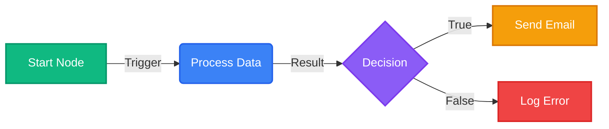
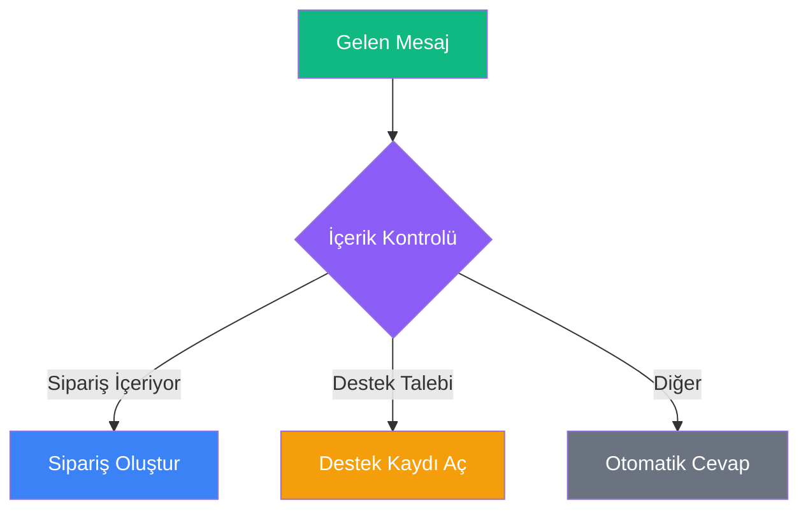
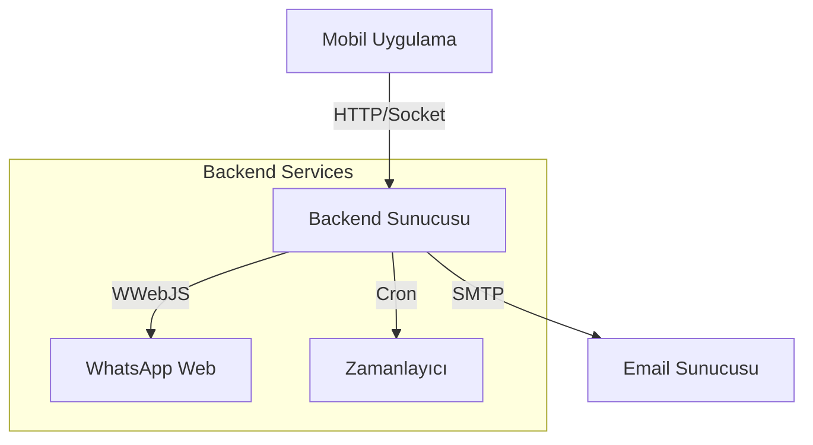

# BreviAI İş Akışı (Workflow) Rehberi

> **Özet:** Bu rehber, BreviAI otomasyon sistemini kullanarak nasıl iş akışları oluşturacağınızı, yönetebileceğinizi ve hata ayıklayabileceğinizi öğrenmeniz için hazırlanmıştır. n8n benzeri düğüm tabanlı yapısı sayesinde kod yazmadan karmaşık süreçleri otomatize edebilirsiniz.

---

## 📚 İçindekiler

1. [Temel Kavramlar](#temel-kavramlar)
2. [Arayüz Tanıtımı](#arayüz-tanıtımı)
3. [Düğüm Referansı (Node Reference)](#düğüm-referansı)
4. [Backend & Altyapı](#backend--altyapı)
5. [Örnek Senaryolar](#örnek-senaryolar)

---

## 1. Temel Kavramlar

### İş Akışı (Workflow) Nedir?
Bir iş akışı, belirli bir görevi yerine getirmek için birbirine bağlanmış **Düğümler (Nodes)** koleksiyonudur. Her iş akışı bir **Tetikleyici (Trigger)** ile başlar (örneğin: bir zamanlayıcı, bir webhook veya manuel tetikleme) ve ardından gelen düğümler sırayla çalışır.

### Düğümler (Nodes)
Düğümler, iş akışınızın yapı taşlarıdır. Her düğüm belirli bir görevi yerine getirir:
*   **Tetikleyiciler (Triggers):** Akışı başlatan olaylardır (Örn: `Cron`, `Webhook`, `App Trigger`).
*   **Eylemler (Actions):** Bir iş yapan düğümlerdir (Örn: `HTTP Request`, `Send Email`, `Google Sheets Read`).
*   **Mantık (Logic):** Akışın yönünü değiştiren düğümlerdir (Örn: `IF`, `Switch`, `Code`).

### Bağlantılar (Edges)
Düğümleri birbirine bağlayan çizgilerdir. Veri, bu bağlantılar üzerinden soldan sağa doğru akar.

### Veri Akışı (Data Flow) ve JSON
BreviAI'de düğümler arasındaki veri alışverişi **JSON** formatında olur. Bir düğümün çıktısı, kendisinden sonra gelen düğümün girdisi olur.

**Örnek Veri Yapısı:**
```json
[
  {
    "id": 1,
    "name": "Örnek Müşteri",
    "email": "ornek@breviai.com"
  }
]
```

### İfadeler (Expressions) ve Değişkenler
Bir düğümün ayarlarında, önceki düğümlerden gelen verileri dinamik olarak kullanabilirsiniz. Bu yapı, `{{ ... }}` sözdizimi ile çalışır.

#### 1. Temel Kullanım
*   **Doğrudan Değişken:** `{{degiskenAdi}}`
*   **JSON Yolu:** `{{degiskenAdi.altAlan.deger}}`
*   **Dizi Erişimi:** `{{liste[0].ad}}`

#### 2. Özel Değişkenler
BreviAI, her düğümde kullanılabilen bazı özel değişkenler sunar:
*   `{{userInput}}`: Kullanıcının chat ekranından girdiği son mesaj.
*   `{{$json}}`: Mevcut düğüme gelen tüm JSON verisi.
*   `{{$now}}`: Şu anki zaman damgası (ISO formatında).

#### 3. Örnek Senaryolar
Bir önceki düğümden (Örn: `HttpRequest`) şöyle bir yanıt döndüğünü varsayalım:
```json
{
  "user": {
    "name": "Ali",
    "roles": ["admin", "editor"]
  },
  "status": "active"
}
```

*   Kullanıcı adını almak için: `{{user.name}}` -> "Ali"
*   İlk rolü almak için: `{{user.roles[0]}}` -> "admin"
*   Durumu bir metin içinde kullanmak için: `Kullanıcı durumu: {{status}}` -> "Kullanıcı durumu: active"

> [!NOTE]
> Yazım hatası yaparsanız (örneğin `{{user.nam}}`), ifade boş bir metin ("") olarak döner ve hata vermez.


---

## 2. Arayüz Tanıtımı



*(Yukarıdaki diyagram, temel bir akışı göstermektedir.)*


*   **Tuval (Canvas):** Düğümleri sürükleyip bıraktığınız ve bağladığınız ana çalışma alanı.
*   **Düğüm Paneli:** Ekranın solunda/altında bulunan, kullanabileceğiniz düğümlerin listesi.
*   **Özellikler Paneli:** Seçili düğümün ayarlarını yapılandırdığınız alan.
*   **Çalıştır (Execute):** İş akışını test etmek için kullanılan buton.

---

## 3. Düğüm Referansı

### ⚡ Tetikleyiciler (Triggers)

#### Manual Trigger
*   **Özet:** İş akışını uygulama içinden manuel olarak (butona basarak) başlatır.
*   **Girdi:** Yok.
*   **Çıktı:** Boş JSON nesnesi veya tetikleme anındaki parametreler.

#### Time Trigger (Cron / Zamanlayıcı)
*   **Özet:** İş akışını belirli zamanlarda, periyodik olarak veya belirli tarihlerde otomatik başlatır.
*   **Parametreler:**
    *   `Schedule`: Cron ifadesi. Bu ifade, zamanlamanın "matematiksel" formülüdür.
    *   `Repeat`: Tekrarlı mı? (True: Her zaman, False: Sadece bir kere).

##### ⏳ Sık Kullanılan Cron İfadeleri
Kopyalayıp kullanabileceğiniz hazır zamanlama şablonları:

| Açıklama | Cron İfadesi | Anlamı |
| :--- | :--- | :--- |
| **Her Dakika** | `* * * * *` | Durmaksızın her dakika çalışır. |
| **Her Saat Başı** | `0 * * * *` | 13:00, 14:00, 15:00... |
| **Her Gün Sabah 09:00** | `0 9 * * *` | Günde bir kez çalışır. |
| **Hafta İçi Her Sabah** | `0 9 * * 1-5` | Pazartesi'den Cuma'ya sabah 9'da. |
| **Her Cuma Akşamı** | `0 20 * * 5` | Sadece Cuma günleri saat 20:00'de. |
| **Her Ayın 1'i** | `0 0 1 * *` | Maaş günü vb. işler için. |
| **5 Dakikada Bir** | `*/5 * * * *` | :00, :05, :10 geçe... |

> **İpucu:** Backend servisinin (Node-Cron) sunucuda aktif olduğundan emin olun.

#### Notification Trigger (Bildirim Yakalayıcı)
*   **Özet:** Telefonunuza gelen bildirimleri okur ve içeriğine göre akışı tetikler. Banka SMS'leri veya WhatsApp mesajlarını yakalamak için idealdir.
*   **Detaylı Parametreler:**
    *   `Package Name`: Hangi uygulamanın bildirimleri dinlenecek? (Örn: `com.whatsapp`, `com.garanti.cepsubesi`).
    *   `Title Filter`: Bildirim başlığında (Gönderen Kişi) ne yazmalı?
        *   Örn: `Ahmet` yazarsanız sadece Ahmet'ten gelenler tetikler.
    *   `Text Filter`: Bildirim içeriğinde ne geçmeli?

##### 🔍 Regex (Düzenli İfadeler) ile Gelişmiş Filtreleme
Filtre alanlarında Regex kullanarak çok daha akıllı kurallar yazabilirsiniz:

| Amaç | Regex Kodu | Neyi Yakalar? |
| :--- | :--- | :--- |
| **Tam Eşleşme** | `^Kod$` | Sadece "Kod" yazan mesajı yakalar. |
| **İçeren (Büyük/Küçük Harf Duyarsız)** | `(?i).*banka.*` | "Banka", "BANKA", "bankamatik" geçerse yakalar. |
| **Sayı Yakalama** | `\d{6}` | İçinde 6 haneli bir sayı (doğrulama kodu) varsa yakalar. |
| **Belirli Kelimeler** | `(?i)(onay|şifre)` | İçinde "onay" VEYA "şifre" geçenleri yakalar. |

*   **Çıktı (Output JSON):**
    ```json
    {
      "packageName": "com.whatsapp",
      "title": "Ahmet Yılmaz",
      "text": "Toplantı saat 14:00'te.",
      "id": 16273849,
      "postTime": 171542384992
    }
    ```

#### Webhook / Deep Link
*   **Özet:** Dış dünyadan (web sitesi, IFTTT, Zapier) gelen istekleri kabul eden kapıdır.
*   **Parametreler:**
    *   `Path`: Tetikleme yolu. Örn: `contact-form`.
    *   `Method`: GET veya POST.
*   **Kullanım Örneği:**
    *   URLniz: `https://api.breviai.com/webhook/contact-form`
    *   **Güvenlik İpucu:** Webhook URL'nizi gizli tutun.
*   **Çıktı:** Gelen isteğin gövdesi (Body) ve URL parametreleri (Query Params) JSON olarak döner.

### 🛠 Eylemler & Entegrasyonlar

#### HTTP Request (Ağ İsteği)
*   **Özet:** İnternetin bel kemiği. Herhangi bir API'ye istek gönderir, veri çeker veya veri yollar.
*   **Gelişmiş Parametreler:**
    *   `Method`: 
        *   **GET**: Veri okumak için (Örn: Hava durumu çek).
        *   **POST**: Veri göndermek için (Örn: Form kaydet).
        *   **PUT/PATCH**: Güncelleme yapmak için.
        *   **DELETE**: Silmek için.
    *   `URL`: Tam adres (https://...).
    *   `Headers`: Kimlik doğrulama bilgileri buraya girilir.
        *   Örn: `{"Authorization": "Bearer SK-123...", "Content-Type": "application/json"}`
    *   `Body`: POST isteklerinde gönderilecek veri paketi. JSON formatında olmalıdır.
    
##### 🚦 HTTP Durum Kodları Rehberi
İsteğinizin sonucunu anlamak için bu kodları bilmek gerekir:

| Kod | Durum | Anlamı | Ne Yapmalı? |
| :--- | :--- | :--- | :--- |
| **200** | OK | Başarılı. | Veriyi kullanabilirsiniz. |
| **201** | Created | Oluşturuldu. | Kayıt işlemi başarılı. |
| **400** | Bad Request | Hatalı İstek. | Gönderdiğiniz JSON'u veya parametreleri kontrol edin. |
| **401** | Unauthorized | Yetkisiz. | API Anahtarınız (Token) yanlış veya eksik. |
| **403** | Forbidden | Yasaklı. | Token doğru ama bu işlemi yapmaya yetkiniz yok. |
| **404** | Not Found | Bulunamadı. | URL yanlış. |
| **429** | Too Many Requests | Çok Fazla İstek. | Biraz yavaşlayın, API limitine takıldınız. |
| **500** | Server Error | Sunucu Hatası. | Sorun sizde değil, karşı sunucuda. Daha sonra tekrar deneyin. |

**Panel Görünümü:**
```
+--------------------------------------------------+
|  ⚙️ HTTP Request                               X |
+--------------------------------------------------+
|                                                  |
|  URL:                                            |
|  [ https://api.exa...del               ]         |
|                                                  |
|  Method:                                         |
|  ( ) GET   (•) POST   ( ) PUT                    |
|                                                  |
|  Headers (JSON):                                 |
|  [ {"Authorization": "Bearer..."}      ]         |
|                                                  |
|  Body:                                           |
|  [ {"data": "{{userInput}}"}           ]         |
|                                                  |
|                       [ İPTAL ]   [ KAYDET ]     |
+--------------------------------------------------+
```
*(Yukarıdaki şema, düğüm ayarlarının nasıl yapılandırıldığını gösterir.)*


#### Google Sheets Read / Write (E-Tablolar)
*   **Özet:** Excel tablolarını bir veritabanı gibi kullanmanızı sağlar.
*   **Kurulum (Çok Önemli):**
    1.  Google Cloud Console'dan bir **Service Account** oluşturun.
    2.  İndirdiğiniz JSON dosyasındaki `client_email` adresini kopyalayın.
    3.  İşlem yapmak istediğiniz Google E-Tablosunu açın.
    4.  "Paylaş" butonuna basıp, kopyaladığınız e-posta adresine **Editör** yetkisi verin.
*   **Parametreler:**
    *   `Action`: Read (Oku) veya Write (Yaz).
    *   `Spreadsheet ID`: Tablo URL'sindeki uzun kod.
        *   `docs.google.com/spreadsheets/d/`**BU_KISIM_ID_DIR**`/edit`
    *   `Range`: Hangi hücreler okunacak/yazılacak? (Örn: `Sayfa1!A1:C10`).
    *   `Value Input Option`:
        *   `RAW`: Formülleri metin olarak yazar.
        *   `USER_ENTERED`: Kullanıcı yazmış gibi davranır (Formülleri çalıştırır, sayıları tanır).

#### WhatsApp Send
*   **Özet:** İş akışından WhatsApp mesajı atar.
*   **Bağlantı Türleri:**
    1.  **Backend (Tavsiye Edilen):** QR kod ile bağladığınız kendi numaranızı kullanır. Ücretsizdir.
    2.  **Cloud API:** Meta'nın resmi API'sidir. Ücretli olabilir ve onaylı işletme hesabı gerektirir.
*   **Parametreler:**
    *   `Phone Number`: Alıcı numarası.
    *   `Message`: Mesaj içeriği.
*   **Kullanım İpuçları:**
    *   Numarayı uluslararası formatta yazın ama `+` koymayın (Örn: `905321234567`).
    *   Mesaj içeriğinde `\n` kullanarak alt satıra geçebilirsiniz.
*   **Çıktı:** Gönderim durumu (Success/Fail).

### 🧠 Mantık & İşleme

#### IF / IF-ELSE (Mantıksal Karar)
*   **Özet:** Verilen koşula göre akışı "Doğru" (True) veya "Yanlış" (False) yoluna saptırır.
*   **Parametreler:**
    *   `Conditions`: Karşılaştırma listesi (AND/OR mantığı).
    *   `Operator`: `==`, `!=`, contains, startsWith, vb.
*   **Karşılaştırma Operatörleri:**

| Operatör | Anlamı | Örnek Durum |
| :--- | :--- | :--- |
| **Equal (==)** | Eşittir | `Durum` == `Başarılı` |
| **Not Equal (!=)** | Eşit Değildir | `Hata` != `Yok` |
| **> / >=** | Büyüktür | `Fiyat` > `1000` |
| **< / <=** | Küçüktür | `Stok` < `5` |
| **Contains** | İçerir | `Mesaj` contains `sipariş` |
| **Starts With** | İle Başlar | `Telefon` startsWith `+90` |
| **Ends With** | İle Biter | `Dosya` endsWith `.pdf` |
| **Matches Regex** | Regex Uyar | `Email` matches `^[\w-\.]+@([\w-]+\.)+[\w-]{2,4}$` |
*   **Çıktı:**

Veri, koşulun sonucuna göre `True` veya `False` çıkışına yönlendirilir.

#### Switch
*   **Özet:** Bir değişkenin değerine göre akışı birden fazla yola ayırır.
*   **Parametreler:**
    *   `Variable`: Kontrol edilecek değişken.
    *   `Cases`: Değer ve çıkış portu eşleşmeleri.

#### Loop (Döngü)
*   **Özet:** Bir liste üzerinde (dizi/array) her eleman için işlem yapar.
*   **Parametreler:**
    *   `Items`: Üzerinde dönülecek dizi (Örn: `{{httpResponse.data.users}}`).
*   **Çalışma Mantığı:**
    *   Döngü başladığında, listedeki her öğe sırayla **Loop Body** çıkışına gönderilir.
    *   Döngü içindeki işlemler bittiğinde, akış tekrar başa döner.
    *   Liste bittiğinde, akış **Completed** çıkışından devam eder.

#### Merge
*   **Özet:** Birden fazla koldan gelen akışı tek bir noktada birleştirir.
*   **Kullanım:** Genellikle IF veya Switch düğümlerinden ayrılan kolları tekrar birleştirmek veya parallel çalışan işlemlerin bitmesini beklemek için kullanılır.


#### Code Execution (Javascript Çalıştır)
*   **Özet:** Standart düğümlerin yetersiz kaldığı yerde, kendi Javascript kodunuzu yazarak sınırsız işlem yapabilirsiniz.
*   **Parametreler:**
    *   `Code`: Çalıştırılacak JS kodu. `input` ve `variables` nesnelerine erişebilir.
*   **Erişilebilir Nesneler:**
    *   `input`: Önceki düğümden gelen veri.
    *   `variables`: Akış genelindeki değişkenler.
*   **Sık Kullanılan Kod Parçacıkları (Snippet):**

**1. Tarih Formatlama:**
```javascript
// Bugünü YYYY-MM-DD formatına çevir
const today = new Date().toISOString().split('T')[0];
return { todayDate: today };
```

**2. Matematiksel İşlem (KDV Hesapla):**
```javascript
const fiyat = input.price;
const kdvli = fiyat * 1.20;
return { net: fiyat, brut: kdvli };
```

**3. Metin Birleştirme:**
```javascript
const ad = input.user.firstName;
const soyad = input.user.lastName;
return { tamAd: `${ad} ${soyad}` };
```

### 🤖 Yapay Zeka (AI)

#### Agent AI
*   **Özet:** LLM (Large Language Model) kullanarak karmaşık görevleri yerine getirir.
*   **Parametreler:**
    *   `Provider`: Gemini, OpenAI, Claude.
    *   `Model`: Kullanılacak model (Örn: `gemini-pro`).
    *   `Prompt`: YZ'ye verilecek talimat.
    *   `Tools`: Agent'ın kullanabileceği araçlar (Web Search, Calculator vb.).
*   **Çıktı:** YZ'nin yanıtı ve (varsa) çalıştırdığı araçların sonuçları.

#### Image Generator
*   **Özet:** Metinden görüntü oluşturur.
*   **Parametreler:**
    *   `Provider`: Nanobana, Pollinations, Gemini.
    *   `Prompt`: Görüntü açıklaması.
    *   `Size`: Boyut (Örn: 1024x1024).


### 📱 Cihaz & Sensörler

#### Notification (Output)
*   **Özet:** Kullanıcıya bir bildirim gösterir.
*   **Parametreler:**
    *   `Title`: Bildirim başlığı.
    *   `Message`: Bildirim içeriği.
    *   `Type`: Toast (kısa süre görünen) veya Push (bildirim çubuğunda).

#### Battery Check
*   **Özet:** Cihazın pil seviyesini ve şarj durumunu kontrol eder.
*   **Çıktı:**
    ```json
    {
      "level": 85,
      "isCharging": true
    }
    ```

#### Location Get
*   **Özet:** Cihazın mevcut GPS konumunu alır.
*   **Parametreler:**
    *   `Accuracy`: Hassasiyet (Low, Medium, High).
*   **Çıktı:** Enlem, boylam ve adres bilgisi.

#### App Launch (Uygulama Başlat)
*   **Özet:** İş akışınızın bir parçası olarak telefonunuzdaki herhangi bir uygulamayı otomatik olarak açar. Bu özellik, "Sabah Rutini" gibi otomasyonlarda çok kullanışlıdır.
*   **Parametreler:**
    *   `Package Name`: Açmak istediğiniz uygulamanın Android sistemindeki teknik kimlik adıdır. (Örn: `com.whatsapp`). Bu ad, uygulamanın parmak izi gibidir ve değişmez.

##### 📦 Popüler Uygulama Paket Adları Listesi
Aşağıdaki listeden sık kullanılan uygulamaların kodlarını kopyalayabilirsiniz:

| Uygulama | Paket Adı (Package Name) |
| :--- | :--- |
| **WhatsApp** | `com.whatsapp` |
| **Instagram** | `com.instagram.android` |
| **YouTube** | `com.google.android.youtube` |
| **Spotify** | `com.spotify.music` |
| **Twitter (X)** | `com.twitter.android` |
| **Google Haritalar** | `com.google.android.apps.maps` |
| **Gmail** | `com.google.android.gm` |
| **Chrome** | `com.android.chrome` |
| **Telegram** | `org.telegram.messenger` |
| **Netflix** | `com.netflix.mediaclient` |
| **TikTok** | `com.zhiliaoapp.musically` |
| **Snapchat** | `com.snapchat.android` |
| **LinkedIn** | `com.linkedin.android` |
| **Facebook** | `com.facebook.katana` |
| **Garanti BBVA** | `com.garanti.cepsubesi` |
| **İşCep** | `com.isbank.iscep` |

##### ❓ Listede Olmayan Bir Uygulamanın Adını Nasıl Bulurum?
Eğer aradığınız uygulama yukarıdaki listede yoksa, şu yöntemlerle bulabilirsiniz:

**Yöntem 1: Play Store URL'si (En Kolay)**
1.  Bilgisayarınızdan veya telefonunuzdan [Google Play Store](https://play.google.com)'a girin.
2.  Uygulamayı aratıp sayfasına gidin.
3.  Adres çubuğundaki (URL) `id=` kısmından sonraki yazı paket adıdır.
    *   *Örnek URL:* `https://play.google.com/store/apps/details?id=com.adobe.reader`
    *   *Paket Adı:* `com.adobe.reader`

**Yöntem 2: "Package Name Viewer" Uygulaması**
1.  Play Store'dan "Package Name Viewer" adlı ücretsiz uygulamayı indirin.
2.  Uygulamayı açtığınızda telefonunuzdaki tüm yüklü uygulamaların yanında paket adlarını göreceksiniz.

### 🔧 Diğer Araçlar

#### Clipboard Reader
*   **Özet:** Panodaki metni okur.
*   **Çıktı:** `{ "content": "Kopyalanan metin..." }`

#### Text Input
*   **Özet:** İş akışı sırasında kullanıcıdan veri girmesini ister.
*   **Parametreler:**
    *   `Prompt`: Kullanıcıya gösterilecek soru.
    *   `Placeholder`: İpucu metni.
*   **Çıktı:** Kullanıcının girdiği metin.

---

## 4. Backend & Altyapı


### Cron Job Yönetimi (Zamanlanmış Görevler)

#### Sistem Mimarisi


*(Yukarıdaki diyagram, mobil uygulama ile backend servisleri arasındaki ilişkiyi gösterir.)*

Zamanlanmış görevler, uygulamanız kapalıyken bile belirli saatlerde otomasyonların çalışmasını sağlar.

Bu özellik, Node.js tabanlı bir backend sunucusu gerektirir.

**Kurulum:**
1.  Backend sunucusunda `cron-service` modülünün çalıştığından emin olun.
2.  Mobilde otomasyonu oluştururken **Zamanlayıcı (Time Trigger)** düğümü ekleyin.
3.  Otomasyonu **Aktif** hale getirdiğinizde, backend sunucusuna otomatik bir kayıt (POST /cron) gönderilir.

### Kimlik Doğrulama (Credentials)
Hassas veriler (API Key, Token, Şifreler) düğümlerin içine açık metin olarak yazılmamalıdır.
**Ayarlar > Güvenlik > Credentials** menüsünden bu bilgileri güvenli bir şekilde saklayabilirsiniz.

**Kullanım:**
*   Düğüm ayarlarında ilgili alanın yanındaki 🔑 simgesine tıklayın.
*   Listedeki kayıtlı credential'ı seçin (Örn: `openai-api-key`).
*   Workflow çalışırken bu değer güvenli depodan okunur.

### Servis Yönetimi (WhatsApp & Email)
Backend servislerinin durumu **Ayarlar > Servis Durumu** ekranından takip edilebilir.

#### WhatsApp Server
*   WhatsApp mesajlarını göndermek için yerel veya uzak bir WWebJS sunucusu gereklidir.
*   **Bağlantı:** QR kodu okutarak cihazınızı bağlayın.
*   **Durum:** `CONNECTED` olduğunda mesajlar kuyruğa alınmadan anında gönderilir.


---


## 5. Örnek Senaryolar (Cookbook)

### 🗞️ Senaryo 1: RSS'den Özet Çıkarıp WhatsApp'a Gönder
Bu akış, favori haber kaynağınızı takip eder, yeni haberleri yapay zeka ile özetler ve size gönderir.

**Akış Diyagramı:**
`⏰ Cron` → `🌐 HTTP Request` → `⚙️ Code (Parse)` → `🔄 Loop` → `🤖 AI Agent` → `💬 WhatsApp Send`

**Adım Adım Kurulum:**
1.  **Cron Trigger:** Schedule = `0 8 * * *` (Her sabah 08:00).
2.  **HTTP Request:** URL = RSS feed adresi (Örn: `https://feeds.bbci.co.uk/news/rss.xml`), Method = GET.
3.  **Code (JS):** XML yanıtını parse edip son 5 haberi JSON listesine çevirin:
    ```javascript
    const items = input.rss.channel.item.slice(0, 5);
    return { haberler: items.map(i => i.title).join('\n') };
    ```
4.  **AI Agent:** Prompt = "Aşağıdaki haberleri her biri için tek cümlelik Türkçe özet yap: {{haberler}}"
5.  **WhatsApp Send:** To = `905XXXXXXXXX`, Message = `📰 Günün Özeti:\n{{aiOzet}}`.

### 📊 Senaryo 2: Döviz Kuru Takip + Excel Kayıt
5 dakikada bir döviz kurunu kontrol edip Google Sheets'e yazan, kur belirli bir seviyeyi aşarsa bildirim gönderen otomasyon.

**Akış Diyagramı:**
`⏰ Cron (5dk)` → `🌐 HTTP (Kur API)` → `📊 Sheets (Yaz)` → `❓ IF (Kur > 35?)` → `True: 📢 Bildirim`

**Adım Adım Kurulum:**
1.  **Cron Trigger:** `*/5 * * * *` (5 dakikada bir).
2.  **HTTP Request:** Ücretsiz bir döviz API'sinden (Örn: `exchangerate-api.com`) kuru çekin. Method = GET.
3.  **Google Sheets Write:** Spreadsheet ID'nizi girin, Range = `Kurlar!A:C`, Değerler = `[Tarih, Saat, Kur]`.
4.  **IF Node:** Koşul = `{{$json.usd_try}} > 35`.
5.  **True → Notification:** "⚠️ Dolar 35 TL'yi aştı: {{$json.usd_try}}"
6.  **False → (Bağlantı yok):** Kur normalse hiçbir şey yapma.

### 📱 Senaryo 3: Banka SMS'i ile Otomatik Harcama Kaydı
Bankadan gelen harcama bildirimini yakalayıp, tutarı ve mağaza adını otomatik olarak Google Sheets'e kaydeden otomasyon.

**Akış Diyagramı:**
`📩 Bildirim Yakala` → `⚙️ Code (Parse)` → `📊 Sheets (Kaydet)` → `🤖 AI (Kategorize)`

**Adım Adım Kurulum:**
1.  **Notification Trigger:** Package Name = `com.garanti.cepsubesi`, Text Filter = `(?i).*harcama.*`
2.  **Code Execution:** Regex ile SMS'ten tutar ve mağaza adını ayıklayın:
    ```javascript
    const text = input.text;
    const tutar = text.match(/([0-9.,]+)\s*TL/)?.[1] || '0';
    const magaza = text.match(/(?:isyeri|magaza)[\s:]+(.+)/i)?.[1]?.trim() || 'Bilinmiyor';
    return { tutar, magaza, tarih: new Date().toISOString().split('T')[0] };
    ```
3.  **Google Sheets Write:** Range = `Harcamalar!A:D`, Değerler = `[{{tarih}}, {{magaza}}, {{tutar}}, ""]`.
4.  **(İsteğe Bağlı) AI Agent:** Prompt = "{{magaza}} mağazası hangi kategoriye ait? Seçenekler: Market, Restoran, Giyim, Ulaşım, Diğer. Sadece kategori adını yaz."
    *   AI çıktısını 4. sütuna (Kategori) yazın.

---

## 6. İpuçları, En İyi Uygulamalar ve Hata Ayıklama

### En İyi Uygulamalar (Best Practices) - Uzman Tavsiyeleri

Otomasyonlarınızı profesyonel, hatasız ve yönetilebilir hale getirmek için aşağıdaki prensipleri uygulayın.

#### 1. İsimlendirme Sanatı (Naming Convention)
**Sorun:** 50 düğümlük bir projede, 10 tane "HTTP Request" düğümü olursa, hangisinin ne yaptığını hatırlayamazsınız.
**Çözüm:** Her düğüme, yaptığı işi anlatan bir fiil-nesne ismi verin.

*   ❌ **Kötü İsimlendirme:**
    *   `HTTP Request` -> `HTTP Request 1` -> `IF` -> `Google Sheets`
*   ✅ **Doğru İsimlendirme:**
    *   `Bitcoin Fiyatını Çek` -> `Dolar Kurunu Al` -> `Kar Ettim mi?` -> `Excel'e Kaydet`

> **Neden Önemli?** Bir ay sonra projeyi açtığınızda veya başkasıyla paylaştığınızda, akışın ne yaptığını tek bakışta anlayabilmek için.

#### 2. Hata Yönetimi (Error Handling)
**Sorun:** Harici servisler (API'ler) her zaman çalışmayabilir. İnternet kesilebilir, sunucu 500 hatası verebilir. Otomasyonunuzun "sessizce" bozulmasını istemezsiniz.
**Çözüm:** Kritik işlemlerden sonra mutlaka kontrol koyun.

*   **Nasıl Yapılır?**
    1.  `HTTP Request` (veya benzeri işlem) düğümünü ekleyin.
    2.  Hemen arkasına bir `IF` (Mantık) düğümü bağlayın.
    3.  `IF` koşuluna şunu yazın: `{{$json.status}} == 200` (veya başarılı olduğunu gösteren kod neyse).
    4.  **True (Doğru)** koluna asıl işlemleri (örn: Veritabanına Yaz) bağlayın.
    5.  **False (Yanlış)** koluna bir `Notification` veya `Email` bağlayın: "Hata oluştu, işlem yapılamadı."

#### 3. Parçala ve Yönet (Modular Design)
**Sorun:** Tek bir sayfada 100 düğümlük devasa bir "Her Şeyi Yapan Akış" tasarlamak. Yönetmesi imkansızdır, bir yer bozulursa hepsi durur.
**Çözüm:** "Execute Workflow" düğümünü kullanarak alt akışlar oluşturun.

*   **Örnek Tasarım:**
    *   `Ana Akış (Cron Trigger)` -> `Haberleri Getir (Alt Akış)` -> `Hava Durumu (Alt Akış)` -> `Raporla (Alt Akış)`
*   **Avantajı:** "Haberleri Getir" kısmı bozulursa, sadece o küçük akışı düzeltirsiniz. Diğerleri çalışmaya devam eder.

#### 4. Güvenlik ve Gizlilik (Credentials)
**Sorun:** API Anahtarlarını (Örn: `sk-12345...`) doğrudan düğümlerin içine yazmak.
**Risk:**
    *   Akışı ekran görüntüsü alıp paylaşırsanız şifreniz çalınır.
    *   Dosyayı (JSON) birine gönderirseniz şifreniz içinde gider.
**Çözüm:**
    *   **Ayarlar > Credentials** menüsüne gidin.
    *   `Yeni Ekle` diyerek şifrenizi buraya kaydedin ve bir isim verin (Örn: `Ofis OpenAI Key`).
    *   Düğümün içinde anahtar simgesine tıklayıp bu ismi seçin.
    *   Artık şifreniz veritabanında şifreli (encrypted) olarak saklanır ve akış dosyasında görünmez.


> [!WARNING]
> **Veri Tipleri:** Sayısal değerleri metin olarak göndermemeye dikkat edin. IF koşullarında `1` (sayı) ile `"1"` (metin) birbirine eşit değildir.

### Sık Karşılaşılan Sorunlar

**1. WhatsApp Mesajı Gitmiyor**
*   **Çözüm:** `Ayarlar > Servis Durumu` menüsünden "WhatsApp Connected" yazısını gördüğünüzden emin olun. Eğer bağlı değilse QR kodu tekrar okutun.

**2. Otomasyon Tetiklenmiyor**
*   **Çözüm:** Otomasyonun "AKTİF" anahtarının açık olduğundan emin olun. Zamanlayıcı trigger'ı kullanıyorsanız backend sunucusunun (Cron Service) çalıştığını kontrol edin.

**3. "Client not ready" Hatası**
*   **Çözüm:** Backend servisi WhatsApp'a henüz bağlanmamıştır. Birkaç saniye bekleyin veya servisi yeniden başlatın.

**4. Değişken Bulunamadı**
*   **Çözüm:** Bir düğümün çıktısını (`{{nodeName.data}}`) kullanmadan önce, o düğümün akışta *daha önce* çalıştığından emin olun.

