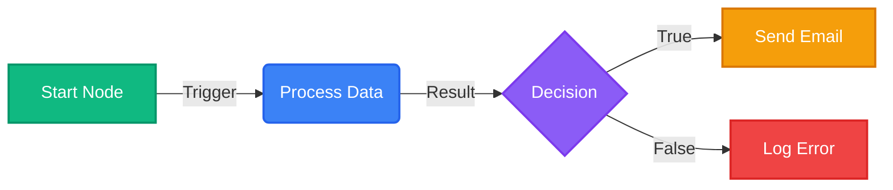
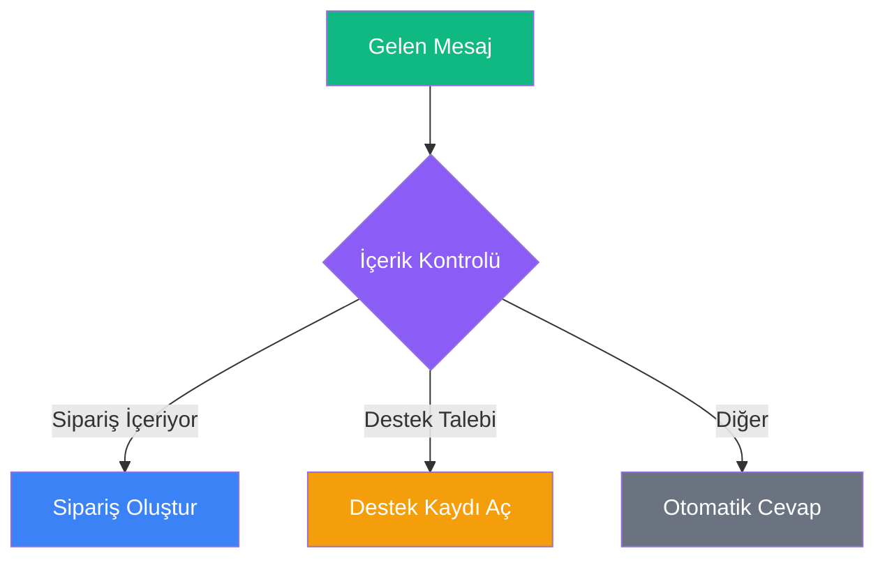
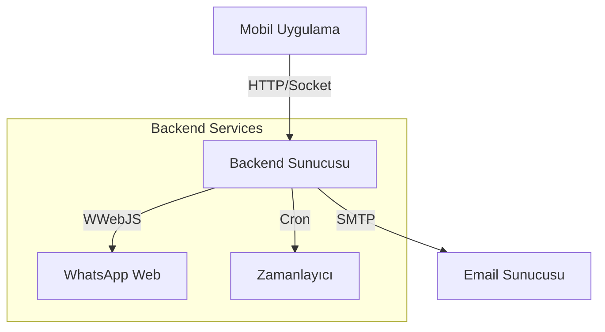

# BreviAI İş Akışı (Workflow) Rehberi

> **Özet:** Bu rehber, BreviAI otomasyon sistemini kullanarak nasıl iş akışları oluşturacağınızı, yönetebileceğinizi ve hata ayıklayabileceğinizi öğrenmeniz için hazırlanmıştır. n8n benzeri düğüm tabanlı yapısı sayesinde kod yazmadan karmaşık süreçleri otomatize edebilirsiniz.

---

## 📚 İçindekiler

1. [Temel Kavramlar](#temel-kavramlar)
2. [Arayüz Tanıtımı](#arayüz-tanıtımı)
3. [Düğüm Referansı (Node Reference)](#düğüm-referansı)
4. [Backend & Altyapı](#backend--altyapı)
5. [Örnek Senaryolar](#örnek-senaryolar)

---

## 1. Temel Kavramlar

### İş Akışı (Workflow) Nedir?
Bir iş akışı, belirli bir görevi yerine getirmek için birbirine bağlanmış **Düğümler (Nodes)** koleksiyonudur. Her iş akışı bir **Tetikleyici (Trigger)** ile başlar (örneğin: bir zamanlayıcı, bir webhook veya manuel tetikleme) ve ardından gelen düğümler sırayla çalışır.

### Düğümler (Nodes)
Düğümler, iş akışınızın yapı taşlarıdır. Her düğüm belirli bir görevi yerine getirir:
*   **Tetikleyiciler (Triggers):** Akışı başlatan olaylardır (Örn: `Cron`, `Webhook`, `App Trigger`).
*   **Eylemler (Actions):** Bir iş yapan düğümlerdir (Örn: `HTTP Request`, `Send Email`, `Google Sheets Read`).
*   **Mantık (Logic):** Akışın yönünü değiştiren düğümlerdir (Örn: `IF`, `Switch`, `Code`).

### Bağlantılar (Edges)
Düğümleri birbirine bağlayan çizgilerdir. Veri, bu bağlantılar üzerinden soldan sağa doğru akar.

### Veri Akışı (Data Flow) ve JSON
BreviAI'de düğümler arasındaki veri alışverişi **JSON** formatında olur. Bir düğümün çıktısı, kendisinden sonra gelen düğümün girdisi olur.

**Örnek Veri Yapısı:**
```json
[
  {
    "id": 1,
    "name": "Örnek Müşteri",
    "email": "ornek@breviai.com"
  }
]
```

### İfadeler (Expressions) ve Değişkenler
Bir düğümün ayarlarında, önceki düğümlerden gelen verileri dinamik olarak kullanabilirsiniz. Bu yapı, `{{ ... }}` sözdizimi ile çalışır.

#### 1. Temel Kullanım
*   **Doğrudan Değişken:** `{{degiskenAdi}}`
*   **JSON Yolu:** `{{degiskenAdi.altAlan.deger}}`
*   **Dizi Erişimi:** `{{liste[0].ad}}`

#### 2. Özel Değişkenler
BreviAI, her düğümde kullanılabilen bazı özel değişkenler sunar:
*   `{{userInput}}`: Kullanıcının chat ekranından girdiği son mesaj.
*   `{{$json}}`: Mevcut düğüme gelen tüm JSON verisi.
*   `{{$now}}`: Şu anki zaman damgası (ISO formatında).

#### 3. Örnek Senaryolar
Bir önceki düğümden (Örn: `HttpRequest`) şöyle bir yanıt döndüğünü varsayalım:
```json
{
  "user": {
    "name": "Ali",
    "roles": ["admin", "editor"]
  },
  "status": "active"
}
```

*   Kullanıcı adını almak için: `{{user.name}}` -> "Ali"
*   İlk rolü almak için: `{{user.roles[0]}}` -> "admin"
*   Durumu bir metin içinde kullanmak için: `Kullanıcı durumu: {{status}}` -> "Kullanıcı durumu: active"

> [!NOTE]
> Yazım hatası yaparsanız (örneğin `{{user.nam}}`), ifade boş bir metin ("") olarak döner ve hata vermez.


---

## 2. Arayüz Tanıtımı



*(Yukarıdaki diyagram, temel bir akışı göstermektedir.)*


*   **Tuval (Canvas):** Düğümleri sürükleyip bıraktığınız ve bağladığınız ana çalışma alanı.
*   **Düğüm Paneli:** Ekranın solunda/altında bulunan, kullanabileceğiniz düğümlerin listesi.
*   **Özellikler Paneli:** Seçili düğümün ayarlarını yapılandırdığınız alan.
*   **Çalıştır (Execute):** İş akışını test etmek için kullanılan buton.

---

## 3. Düğüm Referansı

### ⚡ Tetikleyiciler (Triggers)

#### Manual Trigger
*   **Özet:** İş akışını uygulama içinden manuel olarak (butona basarak) başlatır.
*   **Girdi:** Yok.
*   **Çıktı:** Boş JSON nesnesi veya tetikleme anındaki parametreler.

#### Time Trigger (Cron)
*   **Özet:** İş akışını belirli zamanlarda veya periyodik olarak başlatır.
*   **Parametreler:**
    *   `Schedule`: Cron ifadesi (Örn: `0 9 * * *` her sabah 09:00).
    *   `Repeat`: Tekrarlı mı? (True/False)
*   **İpucu:** Backend servisinin çalışır durumda olduğundan emin olun.

#### Notification Trigger
*   **Özet:** Belirli bir bildirim geldiğinde akışı başlatır (Örn: Bankadan gelen SMS, WhatsApp mesajı).
*   **Parametreler:**
    *   `Package Name`: Uygulama paket adı (Örn: `com.whatsapp`, `com.instagram.android`).
    *   `Title Filter`: Bildirim başlığı için filtre (Regex destekler).
    *   `Text Filter`: Bildirim içeriği için filtre.
*   **Çıktı:**
    ```json
    {
      "packageName": "com.whatsapp",
      "title": "Ahmet",
      "text": "Merhaba, nasılsın?",
      "id": 123456
    }
    ```

#### Webhook / Deep Link
*   **Özet:** Harici bir URL veya Deep Link (`brevi://run/...`) ile akışı tetikler.
*   **Parametreler:**
    *   `Path`: Tetikleme yolu.
*   **Çıktı:** URL parametreleri JSON olarak döner.

### 🛠 Eylemler & Entegrasyonlar

#### HTTP Request
*   **Özet:** Herhangi bir API'ye HTTP isteği gönderir.
*   **Parametreler:**
    *   `Method`: GET, POST, PUT, DELETE vb.
    *   `URL`: İstek yapılacak adres.
    *   `Headers`: (JSON) Başlık bilgileri.
    *   `Body`: (JSON) Gövde verisi.
*   **Çıktı:**
    ```json
    {
      "data": { ...API yanıtı... },
      "status": 200,
      "headers": { ... }
    }
    ```

**Panel Görünümü:**
```
+--------------------------------------------------+
|  ⚙️ HTTP Request                               X |
+--------------------------------------------------+
|                                                  |
|  URL:                                            |
|  [ https://api.exa...del               ]         |
|                                                  |
|  Method:                                         |
|  ( ) GET   (•) POST   ( ) PUT                    |
|                                                  |
|  Headers (JSON):                                 |
|  [ {"Authorization": "Bearer..."}      ]         |
|                                                  |
|  Body:                                           |
|  [ {"data": "{{userInput}}"}           ]         |
|                                                  |
|                       [ İPTAL ]   [ KAYDET ]     |
+--------------------------------------------------+
```
*(Yukarıdaki şema, düğüm ayarlarının nasıl yapılandırıldığını gösterir.)*


#### Google Sheets Read / Write
*   **Özet:** Google E-Tablolar ile okuma/yazma işlemi yapar.
*   **Parametreler:**
    *   `Action`: Read (Oku) veya Write (Yaz).
    *   `Spreadsheet ID`: Tablo kimliği.
    *   `Range`: Hücre aralığı (Örn: `A1:B10`).
    *   `Value Input`: RAW (Ham) veya USER_ENTERED (Kullanıcı girişi gibi).

#### WhatsApp Send
*   **Özet:** WhatsApp üzerinden mesaj gönderir.
*   **Modlar:**
    1.  **Direct:** Erişilebilirlik servisini kullanarak otomatik gönderir (Ekran açık olmalı).
    2.  **Cloud API:** Meta'nın resmi API'sini kullanır (Token gerekir).
    3.  **Backend:** BreviAI Backend servisi üzerinden (`whatsapp-web.js`) gönderir.
*   **Parametreler:**
    *   `Phone Number`: Alıcı numarası.
    *   `Message`: Mesaj içeriği.
*   **Çıktı:** Gönderim durumu (Success/Fail).

### 🧠 Mantık & İşleme

#### IF / IF-ELSE
*   **Özet:** Koşullu dallanma sağlar.
*   **Parametreler:**
    *   `Conditions`: Karşılaştırma listesi (AND/OR mantığı).
    *   `Operator`: `==`, `!=`, contains, startsWith, vb.
*   **Çıktı:**

Veri, koşulun sonucuna göre `True` veya `False` çıkışına yönlendirilir.

#### Switch
*   **Özet:** Bir değişkenin değerine göre akışı birden fazla yola ayırır.
*   **Parametreler:**
    *   `Variable`: Kontrol edilecek değişken.
    *   `Cases`: Değer ve çıkış portu eşleşmeleri.

#### Loop (Döngü)
*   **Özet:** Bir liste üzerinde (dizi/array) her eleman için işlem yapar.
*   **Parametreler:**
    *   `Items`: Üzerinde dönülecek dizi (Örn: `{{httpResponse.data.users}}`).
*   **Çalışma Mantığı:**
    *   Döngü başladığında, listedeki her öğe sırayla **Loop Body** çıkışına gönderilir.
    *   Döngü içindeki işlemler bittiğinde, akış tekrar başa döner.
    *   Liste bittiğinde, akış **Completed** çıkışından devam eder.

#### Merge
*   **Özet:** Birden fazla koldan gelen akışı tek bir noktada birleştirir.
*   **Kullanım:** Genellikle IF veya Switch düğümlerinden ayrılan kolları tekrar birleştirmek veya parallel çalışan işlemlerin bitmesini beklemek için kullanılır.


#### Code Execution
*   **Özet:** Özel Javascript kodu çalıştırır.
*   **Parametreler:**
    *   `Code`: Çalıştırılacak JS kodu. `input` ve `variables` nesnelerine erişebilir.
*   **Örnek:**
    ```javascript
    // Gelen veriyi işle
    const price = input.price * 1.18; // KDV ekle
    return { price_with_tax: price };
    ```

### 🤖 Yapay Zeka (AI)

#### Agent AI
*   **Özet:** LLM (Large Language Model) kullanarak karmaşık görevleri yerine getirir.
*   **Parametreler:**
    *   `Provider`: Gemini, OpenAI, Claude.
    *   `Model`: Kullanılacak model (Örn: `gemini-pro`).
    *   `Prompt`: YZ'ye verilecek talimat.
    *   `Tools`: Agent'ın kullanabileceği araçlar (Web Search, Calculator vb.).
*   **Çıktı:** YZ'nin yanıtı ve (varsa) çalıştırdığı araçların sonuçları.

#### Image Generator
*   **Özet:** Metinden görüntü oluşturur.
*   **Parametreler:**
    *   `Provider`: Nanobana, Pollinations, Gemini.
    *   `Prompt`: Görüntü açıklaması.
    *   `Size`: Boyut (Örn: 1024x1024).


### 📱 Cihaz & Sensörler

#### Notification (Output)
*   **Özet:** Kullanıcıya bir bildirim gösterir.
*   **Parametreler:**
    *   `Title`: Bildirim başlığı.
    *   `Message`: Bildirim içeriği.
    *   `Type`: Toast (kısa süre görünen) veya Push (bildirim çubuğunda).

#### Battery Check
*   **Özet:** Cihazın pil seviyesini ve şarj durumunu kontrol eder.
*   **Çıktı:**
    ```json
    {
      "level": 85,
      "isCharging": true
    }
    ```

#### Location Get
*   **Özet:** Cihazın mevcut GPS konumunu alır.
*   **Parametreler:**
    *   `Accuracy`: Hassasiyet (Low, Medium, High).
*   **Çıktı:** Enlem, boylam ve adres bilgisi.

#### App Launch
*   **Özet:** Cihazdaki başka bir uygulamayı açar.
*   **Parametreler:**
    *   `Package Name`: Açılacak uygulamanın paket adı (Örn: `com.google.android.youtube`).

### 🔧 Diğer Araçlar

#### Clipboard Reader
*   **Özet:** Panodaki metni okur.
*   **Çıktı:** `{ "content": "Kopyalanan metin..." }`

#### Text Input
*   **Özet:** İş akışı sırasında kullanıcıdan veri girmesini ister.
*   **Parametreler:**
    *   `Prompt`: Kullanıcıya gösterilecek soru.
    *   `Placeholder`: İpucu metni.
*   **Çıktı:** Kullanıcının girdiği metin.

---

## 4. Backend & Altyapı


### Cron Job Yönetimi (Zamanlanmış Görevler)

#### Sistem Mimarisi


*(Yukarıdaki diyagram, mobil uygulama ile backend servisleri arasındaki ilişkiyi gösterir.)*

Zamanlanmış görevler, uygulamanız kapalıyken bile belirli saatlerde otomasyonların çalışmasını sağlar.

Bu özellik, Node.js tabanlı bir backend sunucusu gerektirir.

**Kurulum:**
1.  Backend sunucusunda `cron-service` modülünün çalıştığından emin olun.
2.  Mobilde otomasyonu oluştururken **Zamanlayıcı (Time Trigger)** düğümü ekleyin.
3.  Otomasyonu **Aktif** hale getirdiğinizde, backend sunucusuna otomatik bir kayıt (POST /cron) gönderilir.

### Kimlik Doğrulama (Credentials)
Hassas veriler (API Key, Token, Şifreler) düğümlerin içine açık metin olarak yazılmamalıdır.
**Ayarlar > Güvenlik > Credentials** menüsünden bu bilgileri güvenli bir şekilde saklayabilirsiniz.

**Kullanım:**
*   Düğüm ayarlarında ilgili alanın yanındaki 🔑 simgesine tıklayın.
*   Listedeki kayıtlı credential'ı seçin (Örn: `openai-api-key`).
*   Workflow çalışırken bu değer güvenli depodan okunur.

### Servis Yönetimi (WhatsApp & Email)
Backend servislerinin durumu **Ayarlar > Servis Durumu** ekranından takip edilebilir.

#### WhatsApp Server
*   WhatsApp mesajlarını göndermek için yerel veya uzak bir WWebJS sunucusu gereklidir.
*   **Bağlantı:** QR kodu okutarak cihazınızı bağlayın.
*   **Durum:** `CONNECTED` olduğunda mesajlar kuyruğa alınmadan anında gönderilir.

#### Email Servisi
*   SMTP ayarları `backend/.env` dosyasında yapılandırılmalıdır.
*   Mobil uygulama, e-postaları backend üzerinden (HTTP POST) gönderir.


---


## 5. Örnek Senaryolar (Cookbook)

### Senaryo 1: RSS'den Özet Çıkarıp WhatsApp'a Gönder
Bu akış, favori haber kaynağınızı takip eder, yeni haberleri yapay zeka ile özetler ve size gönderir.

1.  **Cron Trigger:** Her sabah 08:00'de çalışacak şekilde ayarlayın.
2.  **HTTP Request:** RSS feed URL'sine (Örn: `https://feeds.bbci.co.uk/news/rss.xml`) GET isteği atın.
3.  **Code (JS):** XML yanıtını parse edip son 5 haberi JSON listesine çevirin.
4.  **Loop:** Haber listesi üzerinde dönün.
5.  **Agent AI:** Her haber başlığı ve özeti için "Bunu tek cümleyle Türkçe özetle" prompt'u verin.
6.  **WhatsApp Send:** AI çıktısını kendi numaranıza gönderin.

### Senaryo 2: Müşteri Formu ve CRM Kaydı
Web sitenizdeki "İletişim" formunu otomatikleştirin.

1.  **Webhook Trigger:** Formdan gelen POST isteğini karşılar (`/webhook/contact-form`).
2.  **IF Node:** `{{body.email}}` dolu mu kontrol et.
3.  **True Yolu:**
    *   **Google Sheets Write:** Gelen veriyi "Leads" tablosuna ekle.
    *   **Email Send:** Müşteriye "Talebiniz alındı" e-postası gönder.
4.  **False Yolu:**
    *   **Respond to Webhook:** 400 Bad Request hatası dön.

---

## 6. İpuçları, En İyi Uygulamalar ve Hata Ayıklama

### En İyi Uygulamalar (Best Practices)
*   **Adlandırma:** Düğümlere ne iş yaptıklarını anlatan isimler verin (Örn: "HTTP Request" yerine "Get User Data").
*   **Hata Yönetimi (Error Handling):** Kritik HTTP isteklerinden sonra mutlaka bir IF bloğu ile `status == 200` kontrolü yapın.
*   **Küçük Parçalar:** Çok karmaşık tek bir akış yerine, birbirini tetikleyen (Execute Workflow) daha küçük ve yönetilebilir akışlar tasarlayın.
*   **Güvenlik:** API anahtarlarını asla doğrudan düğüm içine yazmayın. Her zaman **Credentials** bölümünü kullanın.


> [!WARNING]
> **Veri Tipleri:** Sayısal değerleri metin olarak göndermemeye dikkat edin. IF koşullarında `1` (sayı) ile `"1"` (metin) birbirine eşit değildir.

### Sık Karşılaşılan Sorunlar

**1. WhatsApp Mesajı Gitmiyor**
*   **Çözüm:** `Ayarlar > Servis Durumu` menüsünden "WhatsApp Connected" yazısını gördüğünüzden emin olun. Eğer bağlı değilse QR kodu tekrar okutun.

**2. Otomasyon Tetiklenmiyor**
*   **Çözüm:** Otomasyonun "AKTİF" anahtarının açık olduğundan emin olun. Zamanlayıcı trigger'ı kullanıyorsanız backend sunucusunun (Cron Service) çalıştığını kontrol edin.

**3. "Client not ready" Hatası**
*   **Çözüm:** Backend servisi WhatsApp'a henüz bağlanmamıştır. Birkaç saniye bekleyin veya servisi yeniden başlatın.

**4. Değişken Bulunamadı**
*   **Çözüm:** Bir düğümün çıktısını (`{{nodeName.data}}`) kullanmadan önce, o düğümün akışta *daha önce* çalıştığından emin olun.

