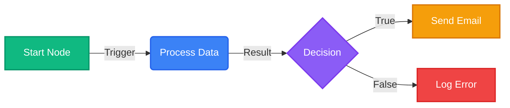
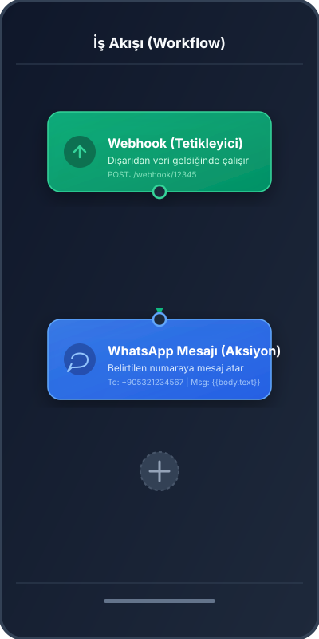
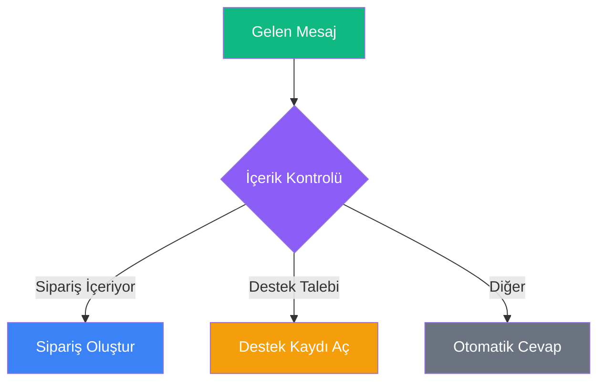
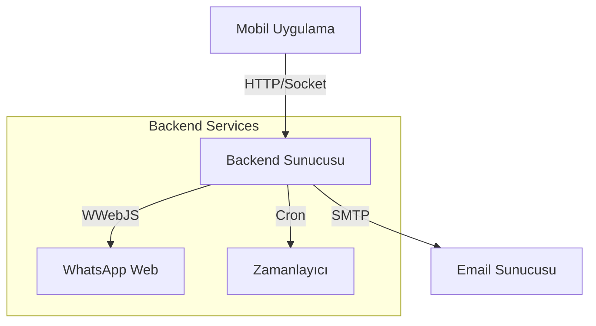

# BreviAI İş Akışı (Workflow) Rehberi

> **Özet:** Bu rehber, BreviAI otomasyon sistemini kullanarak nasıl iş akışları oluşturacağınızı, yönetebileceğinizi ve hata ayıklayabileceğinizi öğrenmeniz için hazırlanmıştır. n8n benzeri düğüm tabanlı yapısı sayesinde kod yazmadan karmaşık süreçleri otomatize edebilirsiniz.

---

## 📚 İçindekiler

1. [Temel Kavramlar](#temel-kavramlar)
2. [Arayüz Tanıtımı](#arayüz-tanıtımı)
3. [Düğüm Referansı (Node Reference)](#düğüm-referansı)
4. [Backend & Altyapı](#backend--altyapı)
5. [Örnek Senaryolar](#örnek-senaryolar)

---

## 1. Temel Kavramlar

### İş Akışı (Workflow) Nedir?
Bir iş akışı, belirli bir görevi yerine getirmek için birbirine bağlanmış **Düğümler (Nodes)** koleksiyonudur. Her iş akışı bir **Tetikleyici (Trigger)** ile başlar (örneğin: bir zamanlayıcı, bir webhook veya manuel tetikleme) ve ardından gelen düğümler sırayla çalışır.

### Düğümler (Nodes)
Düğümler, iş akışınızın yapı taşlarıdır. Her düğüm belirli bir görevi yerine getirir:
*   **Tetikleyiciler (Triggers):** Akışı başlatan olaylardır (Örn: `Cron`, `Webhook`, `App Trigger`).
*   **Eylemler (Actions):** Bir iş yapan düğümlerdir (Örn: `HTTP Request`, `Send Email`, `Google Sheets Read`).
*   **Mantık (Logic):** Akışın yönünü değiştiren düğümlerdir (Örn: `IF`, `Switch`, `Code`).

### Bağlantılar (Edges)
Düğümleri birbirine bağlayan çizgilerdir. Veri, bu bağlantılar üzerinden soldan sağa doğru akar.

### Veri Akışı (Data Flow) ve JSON
BreviAI'de düğümler arasındaki veri alışverişi **JSON** formatında olur. Bir düğümün çıktısı, kendisinden sonra gelen düğümün girdisi olur.

**Örnek Veri Yapısı:**
```json
[
  {
    "id": 1,
    "name": "Örnek Müşteri",
    "email": "ornek@breviai.com"
  }
]
```

### İfadeler (Expressions) ve Değişkenler
Bir düğümün ayarlarında, önceki düğümlerden gelen verileri dinamik olarak kullanabilirsiniz. Bu yapı, `{{ ... }}` sözdizimi ile çalışır.

#### 1. Temel Kullanım
*   **Doğrudan Değişken:** `{{degiskenAdi}}`
*   **JSON Yolu:** `{{degiskenAdi.altAlan.deger}}`
*   **Dizi Erişimi:** `{{liste[0].ad}}`

#### 2. Özel Değişkenler
BreviAI, her düğümde kullanılabilen bazı özel değişkenler sunar:
*   `{{userInput}}`: Kullanıcının chat ekranından girdiği son mesaj.
*   `{{$json}}`: Mevcut düğüme gelen tüm JSON verisi.
*   `{{$now}}`: Şu anki zaman damgası (ISO formatında).

#### 3. Örnek Senaryolar
Bir önceki düğümden (Örn: `HttpRequest`) şöyle bir yanıt döndüğünü varsayalım:
```json
{
  "user": {
    "name": "Ali",
    "roles": ["admin", "editor"]
  },
  "status": "active"
}
```

*   Kullanıcı adını almak için: `{{user.name}}` -> "Ali"
*   İlk rolü almak için: `{{user.roles[0]}}` -> "admin"
*   Durumu bir metin içinde kullanmak için: `Kullanıcı durumu: {{status}}` -> "Kullanıcı durumu: active"

> [!NOTE]
> Yazım hatası yaparsanız (örneğin `{{user.nam}}`), ifade boş bir metin ("") olarak döner ve hata vermez.


---

## 2. Arayüz Tanıtımı



*(Yukarıdaki diyagram, temel bir akışı göstermektedir.)*


*   **Tuval (Canvas):** Düğümleri sürükleyip bıraktığınız ve bağladığınız ana çalışma alanı.
*   **Düğüm Paneli:** Ekranın solunda/altında bulunan, kullanabileceğiniz düğümlerin listesi.
*   **Özellikler Paneli:** Seçili düğümün ayarlarını yapılandırdığınız alan.
*   **Çalıştır (Execute):** İş akışını test etmek için kullanılan buton.

### Arayüz Görünümü (Mockup)
Aşağıdaki görselde, BreviAI mobil uygulamasında bir **Webhook** tetikleyicisinin nasıl **WhatsApp Mesaj Gönder** düğümüne bağlandığını görebilirsiniz:

<p align="center">
  
</p>
*(Bir dış servisten gelen POST isteğinin yakalanıp, bir telefon numarasına iletilmesi)*

---

## 3. Düğüm Referansı

### ⚡ Tetikleyiciler (Triggers)

#### 1. Manual Trigger (Elle Başlatma)
*   **Amaç:** Kullanıcının butona basarak akışı başlatması. Test süreçleri ve on-demand (ihtiyaç anında) işler için idealdir.
*   **Çıktı:** `{ "executionId": "12345", "timestamp": "...", "input": {} }`

**Gelişmiş Ayarlar - Giriş Parametreleri (Form):**
Akış başlatılırken kullanıcıdan veri isteyebilirsiniz. "Add Parameter" butonu ile form oluşturun:

| Parametre Tipi | Açıklama | Örnek Kullanım |
| :--- | :--- | :--- |
| **String (Metin)** | Kısa yazı girişi. | "Müşteri Adı", "Aranacak Kelime" |
| **Number (Sayı)** | Matematiksel işlemler için sayı. | "Tekrar Sayısı", "Fiyat Limiti" |
| **Boolean (E/H)** | Aç/Kapa anahtarı. | "PDF İndirilsin mi?", "Sessiz Mod" |
| **Select (Seçim)** | Açılır liste (Dropdown). | "Renk: [Kırmızı, Mavi]", "Mod: [Hızlı, Yavaş]" |

> **İpucu:** Bu parametrelere akış içinde `{{input.parametreAdi}}` şeklinde erişebilirsiniz.

---

#### 2. Time Trigger (Zamanlayıcı / Cron)
*   **Amaç:** Akışı belirli bir saatte, günün belirli zamanlarında veya periyodik aralıklarla otomatik başlatmak.
*   **Modlar:**
    1.  **Interval (Aralık):** "Her 15 dakikada bir çalış".
    2.  **Cron Expression:** Çok detaylı zamanlama (Backend servisi gerektirir).
    3.  **Specific Date:** Tek seferlik ileri tarihli görev (Örn: "1 Ocak 2027 00:00").

**Cron İfadeleri Ansiklopedisi:**
Cron formatı: `Dakika Saat Gün Ay HaftanınGünü`

| İfade | Açıklama | Kullanım Senaryosu |
| :--- | :--- | :--- |
| `* * * * *` | Her Dakika | Sistem takibi, çok sık kontrol. |
| `*/5 * * * *` | 5 Dakikada Bir | Borsa/Döviz takibi. |
| `0 * * * *` | Saat Başı (:00) | Raporlama, durum kontrolü. |
| `30 * * * *` | Her Saat Buçukta (:30) | Ara kontroller. |
| `0 9 * * *` | Her Gün 09:00 | "Günaydın" mesajı, günlük plan. |
| `0 18 * * 1-5` | Hafta İçi 18:00 | "Mesai bitti" bildirimi. |
| `0 20 * * 5` | Cuma 20:00 | Haftalık özet, eğlence modu. |
| `0 0 1 * *` | Her Ayın 1'i | Fatura ödeme hatırlatması. |
| `0 0 1 1 *` | Yılbaşı (1 Ocak) | Yıllık bakım. |

> **⚠️ Önemli:** Cron tetikleyicilerin çalışması için sunucuda `node-cron` servisinin aktif olması gerekir. `Ayarlar > Servis Durumu` ekranından "Cron Service: Active" yazısını kontrol edin.

---

#### 3. Notification Trigger (Bildirim Yakalayıcı)
*   **Amaç:** Telefonunuza gelen bildirimleri okuyup akışı başlatmak. Banka SMS'leri, WhatsApp mesajları veya uygulama bildirimleri ile otomasyon yapmanızı sağlar.
*   **Çıktı (JSON):**
    ```json
    {
      "packageName": "com.whatsapp",
      "title": "Ahmet",
      "text": "Yarın buluşuyor muyuz?",
      "postTime": 1708934000000,
      "appName": "WhatsApp"
    }
    ```

**Parametre Detayları:**

| Parametre | Zorunlu? | Açıklama |
| :--- | :--- | :--- |
| **Package Name** | Evet | Hangi uygulamanın dinleneceği. (Örn: `com.whatsapp`, `com.garanti.cepsubesi`) |
| **Text Filter** | Hayır | Mesaj içeriğinde aranacak Regex kalıbı. Boş bırakılırsa hepsini yakalar. |
| **Title Filter** | Hayır | Bildirim başlığında (Gönderen kişi) aranacak Regex. |

**Regex Filtreleme Kütüphanesi:**
`Text Filter` alanında kullanabileceğiniz hazır kalıplar:

| Senaryo | Regex Kodu | Açıklama |
| :--- | :--- | :--- |
| **Banka Harcaması** | `(?i).*harcama.*` | İçinde "harcama" geçen tüm mesajlar (Büyük/küçük harf duyarsız). |
| **OTP Kodları** | `\d{4,6}` | 4 ile 6 haneli herhangi bir sayı içeren mesajlar. |
| **Belirli Kelime** | `^Onay$` | Mesaj SADECE "Onay" kelimesinden oluşuyorsa. |
| **VEYA Mantığı** | `(sipariş|kargo|teslim)` | İçinde "sipariş", "kargo" VEYA "teslim" geçenler. |
| **Yasaklı Kelime** | `^((?!reklam).)*$` | İçinde "reklam" geçmeyen mesajlar. |

> **Sorun Giderme:** Bildirimler tetiklenmiyorsa:
> 1. Telefonun "Bildirim Erişimi" izinlerinde BreviAI'ya yetki verdiğinizden emin olun.
> 2. Pil tasarrufu modunun BreviAI uygulamasını kapatmadığını kontrol edin.

---

#### 4. Webhook Trigger (Dış Bağlantı)
*   **Amaç:** Dış dünyadan (IFTTT, Zapier, Kendi Siteniz) gelen HTTP istekleriyle akışı başlatmak.
*   **URL Formatı:** `https://breviai.vercel.app/webhook/{webhookId}`
*   **Method:** `GET` veya `POST` destekler.

**Çıktı (JSON):**
```json
{
  "body": { "email": "ali@test.com", "mesaj": "Selam" },
  "query": { "source": "twitter" },
  "headers": { "content-type": "application/json" }
}
```

*   `{{body.email}}` -> POST gövdesindeki veriyi okur.
*   `{{query.source}}` -> URL parametresini (?source=twitter) okur.

> **Güvenlik İpucu:** Webhook URL'nizi gizli tutun. URL'yi bilen herkes akışınızı tetikleyebilir.

### 🛠 Eylemler & Entegrasyonlar

#### 1. HTTP Request (Ağ İsteği)
*   **Amaç:** İnternetin bel kemiği. Herhangi bir API'ye bağlanmanızı sağlar.
*   **Kullanım Alanları:** Hava durumu çekmek, döviz kuru almak, başka bir sunucuya veri göndermek.

**Parametre Ansiklopedisi:**

| Parametre | Seçenekler | Açıklama |
| :--- | :--- | :--- |
| **Method** | `GET` | Veri okumak için. (Tarayıcıda link açmak gibidir). Body gönderilmez. |
| | `POST` | Veri göndermek/oluşturmak için. (Form doldurmak gibidir). Body gerektirir. |
| | `PUT` | Veri güncellemek için (Tüm kaynağı değiştirir). |
| | `PATCH` | Veri güncellemek için (Sadece değişen kısmı günceller). |
| | `DELETE` | Veri silmek için. |
| **URL** | `https://...` | İsteğin gideceği tam adres. Query parametreleri de eklenebilir. |
| **Headers** | JSON | Kimlik doğrulama ve veri tipi bilgileri. <br>Örn: `{"Authorization": "Bearer TOKEN", "Content-Type": "application/json"}` |
| **Body** | JSON | `POST/PUT/PATCH` metodlarında gönderilecek veri paketi. <br>Örn: `{"name": "Ali", "age": 25}` |

**🚦 HTTP Durum Kodları (Status Codes):**
Sunucunun cevabını anlamak hayati önem taşır.

| Kod | Durum | Anlamı | Aksiyon |
| :--- | :--- | :--- | :--- |
| **200** | OK | Başarılı. | Veriyi `{{http.data}}` ile kullanabilirsiniz. |
| **201** | Created | Oluşturuldu. | Kayıt başarıyla açıldı. |
| **204** | No Content | Başarılı (Boş). | İşlem tamam ama geri dönecek veri yok. |
| **400** | Bad Request | Hatalı İstek. | Gönderdiğiniz JSON formatı bozuk veya eksik parametre var. |
| **401** | Unauthorized | Yetkisiz. | API Key yanlış, eksik veya süresi dolmuş. |
| **403** | Forbidden | Yasaklı. | Giriş yaptınız ama bu işlemi yapmaya yetkiniz yok. |
| **404** | Not Found | Bulunamadı. | URL yanlış veya kaynak silinmiş. |
| **429** | Too Many Req | Çok Hızlı. | API limitine takıldınız. Biraz bekleyin. |
| **500** | Server Error | Sunucu Hatası. | Sorun karşı tarafta. Daha sonra tekrar deneyin. |
| **502/503** | Gateway/Service | Servis Dışı. | Karşı sunucu şu an bakımda veya kapalı. |

---

#### 2. Google Sheets (E-Tablolar)
*   **Amaç:** Google E-Tablolarını bir veritabanı gibi kullanmak. Veri okuyabilir, satır ekleyebilir veya güncelleyebilirsiniz.

**🔧 Kurulum ve Yetkilendirme (Adım Adım):**
Google Sheets'e erişmek için "Service Account" (Robot Hesap) kullanmalısınız.

1.  **Google Cloud Console**'a gidin ve yeni bir proje oluşturun.
2.  **APIs & Services** > **Enable APIs** menüsünden "Google Sheets API"yi etkinleştirin.
3.  **Credentials** > **Create Credentials** > **Service Account** yolunu izleyin.
4.  Oluşturulan hesaba bir isim verin ve **Done** diyerek bitirin.
5.  Hesabın detayına girip **Keys** sekmesinden **Add Key > JSON** seçeneği ile anahtarı indirin.
6.  İndirdiğiniz JSON dosyasındaki `client_email` adresini kopyalayın (Örn: `breviai-bot@...iam.gserviceaccount.com`).
7.  İşlem yapmak istediğiniz Google E-Tablosunu açın ve **Paylaş** butonuna basarak bu e-posta adresine **Editör** yetkisi verin.

**Parametre Detayları:**

| Parametre | Açıklama | Örnek |
| :--- | :--- | :--- |
| **Action** | `Read` (Oku) veya `Write` (Yaz/Ekle). | - |
| **Spreadsheet ID** | Tablo URL'sindeki uzun kod. | `https://docs.google.com/spreadsheets/d/`**1BxiMVs0XRA5nSLqo...**`/edit` |
| **Range** | Hangi hücreler? | `Sayfa1!A1:C5` (Belirli alan) <br> `Sayfa1!A:A` (Tüm A sütunu) |
| **Values (Write)** | Yazılacak veri (Dizi içinde dizi). | `[ ["Ad", "Soyad"], ["Ali", "Veli"] ]` |

> **İpucu:** Yazarken `USER_ENTERED` modunu seçerseniz, gönderdiğiniz formüller (örn: `=TOBB(A1)`) excel tarafından işlenir. `RAW` seçerseniz metin olarak kalır.

---

#### 3. WhatsApp Send
*   **Amaç:** İş akışınızdan belirlediğiniz numaralara otomatik WhatsApp mesajı göndermek.

**Bağlantı Türleri:**
1.  **Backend (WWebJS):** Kendi numaranızı kullanır. Ücretsizdir. QR kod ile bağlanır.
2.  **Cloud API:** Meta'nın resmi API'sidir. İşletme hesabı ve şablon onayı gerektirir. (Daha stabil ama ücretli olabilir).

**Parametreler:**

| Parametre | Açıklama | Örnek |
| :--- | :--- | :--- |
| **To (Alıcı)** | Telefon numarası. Ülke kodu olmalı, `+` olmamalı. | `905321234567` (Doğru) <br> `0532...` (Yanlış) |
| **Message** | Gönderilecek metin. | "Merging tamamlandı. ✅" |
| **Media URL** | (Opsiyonel) Resim/PDF linki. | `https://example.com/fatura.pdf` |

> **İpucu:** Mesaj içinde `\n` karakteri kullanarak alt satıra geçebilirsiniz. Örn: `Başlık\nDetaylar...`

---

#### 4. Code Execution (Javascript Çalıştır)
*   **Amaç:** Standart düğümlerin yetersiz kaldığı yerde, kendi Javascript kodunuzu yazarak sınırsız işlem yapabilirsiniz.
*   **Erişim:** `input` (önceki düğüm verisi) ve `variables` (global değişkenler) nesnelerine erişir.

**Sık Kullanılan Snippet Kütüphanesi:**

| Senaryo | Kod Örneği | Açıklama |
| :--- | :--- | :--- |
| **Bugünün Tarihi** | `return { date: new Date().toISOString().split('T')[0] };` | YYYY-MM-DD formatında tarih döner. |
| **Metin İşleme** | `return { upper: input.text.toUpperCase() };` | Gelen metni BÜYÜK HARFE çevirir. |
| **Matematik** | `return { kdvliFiyat: input.fiyat * 1.20 };` | Fiyata %20 KDV ekler. |
| **Liste Filtreleme** | `return { aktifler: input.users.filter(u => u.active) };` | Sadece aktif kullanıcıları seçer. |
| **Rastgele Sayı** | `return { zar: Math.floor(Math.random() * 6) + 1 };` | 1-6 arası sayı üretir. |

> **⚠️ Önemli Kural:** Kodunuzun sonunda MUTLAKA `return { ... }` ile bir JSON nesnesi döndürmelisiniz. Sadece `return 5;` yazarsanız hata alırsınız.

---

### 🤖 Yapay Zeka (AI)

#### 1. Agent AI (LLM)
*   **Amaç:** Gemini veya OpenAI modellerini kullanarak metin üretme, özetleme veya karar verme.
*   **Parametreler:**
    *   `Provider`: Google (Gemini) - *Önerilen, hızlı ve ücretsiz kota.*
    *   `Model`: `gemini-1.5-flash` (Hızlı), `gemini-1.5-pro` (Akıllı).
    *   `Prompt`: Yapay zekaya talimatınız. `{{variable}}` kullanabilirsiniz.

**Prompt Mühendisliği İpuçları:**
*   **Rol Yapma:** "Sen uzman bir finans asistanısın."
*   **Format Belirleme:** "Cevabı sadece JSON formatında ver."
*   **Örnekleme:** "Örnek çıktı: {'özet': '...'}"

#### 2. Image Generator
*   **Amaç:** Metinden görsel oluşturur (Text-to-Image).
*   **Provider:**
    *   `Nanobana`: Hızlı ve ücretsiz (SDXL).
    *   `Pollinations`: Çeşitli modeller sunar.
*   **Kullanım:** "Prompt" kısmına İngilizce betimleme yazın (Örn: "A futuristic city with flying cars, cyberpunk style").
*   **Çıktı:** Oluşturulan resmin URL adresi. Bu adresi WhatsApp'a veya E-Tablolara gönderebilirsiniz.

### 🧠 Mantık & İşleme

#### IF / IF-ELSE (Mantıksal Karar)
*   **Özet:** Verilen koşula göre akışı "Doğru" (True) veya "Yanlış" (False) yoluna saptırır.
*   **Parametreler:**
    *   `Conditions`: Karşılaştırma listesi (AND/OR mantığı).
    *   `Operator`: `==`, `!=`, contains, startsWith, vb.
*   **Karşılaştırma Operatörleri:**

| Operatör | Anlamı | Örnek Durum |
| :--- | :--- | :--- |
| **Equal (==)** | Eşittir | `Durum` == `Başarılı` |
| **Not Equal (!=)** | Eşit Değildir | `Hata` != `Yok` |
| **> / >=** | Büyüktür | `Fiyat` > `1000` |
| **< / <=** | Küçüktür | `Stok` < `5` |
| **Contains** | İçerir | `Mesaj` contains `sipariş` |
| **Starts With** | İle Başlar | `Telefon` startsWith `+90` |
| **Ends With** | İle Biter | `Dosya` endsWith `.pdf` |
| **Matches Regex** | Regex Uyar | `Email` matches `^[\w-\.]+@([\w-]+\.)+[\w-]{2,4}$` |
*   **Çıktı:**

Veri, koşulun sonucuna göre `True` veya `False` çıkışına yönlendirilir.

#### Switch
*   **Özet:** Bir değişkenin değerine göre akışı birden fazla yola ayırır.
*   **Parametreler:**
    *   `Variable`: Kontrol edilecek değişken.
    *   `Cases`: Değer ve çıkış portu eşleşmeleri.

#### Loop (Döngü)
*   **Özet:** Bir liste üzerinde (dizi/array) her eleman için işlem yapar.
*   **Parametreler:**
    *   `Items`: Üzerinde dönülecek dizi (Örn: `{{httpResponse.data.users}}`).
*   **Çalışma Mantığı:**
    *   Döngü başladığında, listedeki her öğe sırayla **Loop Body** çıkışına gönderilir.
    *   Döngü içindeki işlemler bittiğinde, akış tekrar başa döner.
    *   Liste bittiğinde, akış **Completed** çıkışından devam eder.

#### Merge
*   **Özet:** Birden fazla koldan gelen akışı tek bir noktada birleştirir.
*   **Kullanım:** Genellikle IF veya Switch düğümlerinden ayrılan kolları tekrar birleştirmek veya parallel çalışan işlemlerin bitmesini beklemek için kullanılır.


### 📱 Cihaz & Sensörler

#### Notification (Output)
*   **Özet:** Kullanıcıya bir bildirim gösterir.
*   **Parametreler:**
    *   `Title`: Bildirim başlığı.
    *   `Message`: Bildirim içeriği.
    *   `Type`: Toast (kısa süre görünen) veya Push (bildirim çubuğunda).

#### Battery Check
*   **Özet:** Cihazın pil seviyesini ve şarj durumunu kontrol eder.
*   **Çıktı:**
    ```json
    {
      "level": 85,
      "isCharging": true
    }
    ```

#### Location Get
*   **Özet:** Cihazın mevcut GPS konumunu alır.
*   **Parametreler:**
    *   `Accuracy`: Hassasiyet (Low, Medium, High).
*   **Çıktı:** Enlem, boylam ve adres bilgisi.

#### App Launch (Uygulama Başlat)
*   **Özet:** İş akışınızın bir parçası olarak telefonunuzdaki herhangi bir uygulamayı otomatik olarak açar. Bu özellik, "Sabah Rutini" gibi otomasyonlarda çok kullanışlıdır.
*   **Parametreler:**
    *   `Package Name`: Açmak istediğiniz uygulamanın Android sistemindeki teknik kimlik adıdır. (Örn: `com.whatsapp`). Bu ad, uygulamanın parmak izi gibidir ve değişmez.

##### 📦 Popüler Uygulama Paket Adları Listesi
Aşağıdaki listeden sık kullanılan uygulamaların kodlarını kopyalayabilirsiniz:

| Uygulama | Paket Adı (Package Name) |
| :--- | :--- |
| **WhatsApp** | `com.whatsapp` |
| **Instagram** | `com.instagram.android` |
| **YouTube** | `com.google.android.youtube` |
| **Spotify** | `com.spotify.music` |
| **Twitter (X)** | `com.twitter.android` |
| **Google Haritalar** | `com.google.android.apps.maps` |
| **Gmail** | `com.google.android.gm` |
| **Chrome** | `com.android.chrome` |
| **Telegram** | `org.telegram.messenger` |
| **Netflix** | `com.netflix.mediaclient` |
| **TikTok** | `com.zhiliaoapp.musically` |
| **Snapchat** | `com.snapchat.android` |
| **LinkedIn** | `com.linkedin.android` |
| **Facebook** | `com.facebook.katana` |
| **Garanti BBVA** | `com.garanti.cepsubesi` |
| **İşCep** | `com.isbank.iscep` |

##### ❓ Listede Olmayan Bir Uygulamanın Adını Nasıl Bulurum?
Eğer aradığınız uygulama yukarıdaki listede yoksa, şu yöntemlerle bulabilirsiniz:

**Yöntem 1: Play Store URL'si (En Kolay)**
1.  Bilgisayarınızdan veya telefonunuzdan [Google Play Store](https://play.google.com)'a girin.
2.  Uygulamayı aratıp sayfasına gidin.
3.  Adres çubuğundaki (URL) `id=` kısmından sonraki yazı paket adıdır.
    *   *Örnek URL:* `https://play.google.com/store/apps/details?id=com.adobe.reader`
    *   *Paket Adı:* `com.adobe.reader`

**Yöntem 2: "Package Name Viewer" Uygulaması**
1.  Play Store'dan "Package Name Viewer" adlı ücretsiz uygulamayı indirin.
2.  Uygulamayı açtığınızda telefonunuzdaki tüm yüklü uygulamaların yanında paket adlarını göreceksiniz.

### 🔧 Diğer Araçlar

#### Clipboard Reader
*   **Özet:** Panodaki metni okur.
*   **Çıktı:** `{ "content": "Kopyalanan metin..." }`

#### Text Input
*   **Özet:** İş akışı sırasında kullanıcıdan veri girmesini ister.
*   **Parametreler:**
    *   `Prompt`: Kullanıcıya gösterilecek soru.
    *   `Placeholder`: İpucu metni.
*   **Çıktı:** Kullanıcının girdiği metin.

---

## 4. Backend & Altyapı


### Cron Job Yönetimi (Zamanlanmış Görevler)

#### Sistem Mimarisi


*(Yukarıdaki diyagram, mobil uygulama ile backend servisleri arasındaki ilişkiyi gösterir.)*

Zamanlanmış görevler, uygulamanız kapalıyken bile belirli saatlerde otomasyonların çalışmasını sağlar.

Bu özellik, Node.js tabanlı bir backend sunucusu gerektirir.

**Kurulum:**
1.  Backend sunucusunda `cron-service` modülünün çalıştığından emin olun.
2.  Mobilde otomasyonu oluştururken **Zamanlayıcı (Time Trigger)** düğümü ekleyin.
3.  Otomasyonu **Aktif** hale getirdiğinizde, backend sunucusuna otomatik bir kayıt (POST /cron) gönderilir.

### Kimlik Doğrulama (Credentials)
Hassas veriler (API Key, Token, Şifreler) düğümlerin içine açık metin olarak yazılmamalıdır.
**Ayarlar > Güvenlik > Credentials** menüsünden bu bilgileri güvenli bir şekilde saklayabilirsiniz.

**Kullanım:**
*   Düğüm ayarlarında ilgili alanın yanındaki 🔑 simgesine tıklayın.
*   Listedeki kayıtlı credential'ı seçin (Örn: `openai-api-key`).
*   Workflow çalışırken bu değer güvenli depodan okunur.

### Servis Yönetimi (WhatsApp & Email)
Backend servislerinin durumu **Ayarlar > Servis Durumu** ekranından takip edilebilir.

#### WhatsApp Server
*   WhatsApp mesajlarını göndermek için yerel veya uzak bir WWebJS sunucusu gereklidir.
*   **Bağlantı:** QR kodu okutarak cihazınızı bağlayın.
*   **Durum:** `CONNECTED` olduğunda mesajlar kuyruğa alınmadan anında gönderilir.


---


## 5. Örnek Senaryolar (Cookbook)

### 🗞️ Senaryo 1: RSS'den Özet Çıkarıp WhatsApp'a Gönder
Bu akış, favori haber kaynağınızı takip eder, yeni haberleri yapay zeka ile özetler ve size gönderir.

**Akış Diyagramı:**
`⏰ Cron` → `🌐 HTTP Request` → `⚙️ Code (Parse)` → `🔄 Loop` → `🤖 AI Agent` → `💬 WhatsApp Send`

**Adım Adım Kurulum:**
1.  **Cron Trigger:** Schedule = `0 8 * * *` (Her sabah 08:00).
2.  **HTTP Request:** URL = RSS feed adresi (Örn: `https://feeds.bbci.co.uk/news/rss.xml`), Method = GET.
3.  **Code (JS):** XML yanıtını parse edip son 5 haberi JSON listesine çevirin:
    ```javascript
    const items = input.rss.channel.item.slice(0, 5);
    return { haberler: items.map(i => i.title).join('\n') };
    ```
4.  **AI Agent:** Prompt = "Aşağıdaki haberleri her biri için tek cümlelik Türkçe özet yap: {{haberler}}"
5.  **WhatsApp Send:** To = `905XXXXXXXXX`, Message = `📰 Günün Özeti:\n{{aiOzet}}`.

### 📊 Senaryo 2: Döviz Kuru Takip + Excel Kayıt
5 dakikada bir döviz kurunu kontrol edip Google Sheets'e yazan, kur belirli bir seviyeyi aşarsa bildirim gönderen otomasyon.

**Akış Diyagramı:**
`⏰ Cron (5dk)` → `🌐 HTTP (Kur API)` → `📊 Sheets (Yaz)` → `❓ IF (Kur > 35?)` → `True: 📢 Bildirim`

**Adım Adım Kurulum:**
1.  **Cron Trigger:** `*/5 * * * *` (5 dakikada bir).
2.  **HTTP Request:** Ücretsiz bir döviz API'sinden (Örn: `exchangerate-api.com`) kuru çekin. Method = GET.
3.  **Google Sheets Write:** Spreadsheet ID'nizi girin, Range = `Kurlar!A:C`, Değerler = `[Tarih, Saat, Kur]`.
4.  **IF Node:** Koşul = `{{$json.usd_try}} > 35`.
5.  **True → Notification:** "⚠️ Dolar 35 TL'yi aştı: {{$json.usd_try}}"
6.  **False → (Bağlantı yok):** Kur normalse hiçbir şey yapma.

### 📱 Senaryo 3: Banka SMS'i ile Otomatik Harcama Kaydı
Bankadan gelen harcama bildirimini yakalayıp, tutarı ve mağaza adını otomatik olarak Google Sheets'e kaydeden otomasyon.

**Akış Diyagramı:**
`📩 Bildirim Yakala` → `⚙️ Code (Parse)` → `📊 Sheets (Kaydet)` → `🤖 AI (Kategorize)`

**Adım Adım Kurulum:**
1.  **Notification Trigger:** Package Name = `com.garanti.cepsubesi`, Text Filter = `(?i).*harcama.*`
2.  **Code Execution:** Regex ile SMS'ten tutar ve mağaza adını ayıklayın:
    ```javascript
    const text = input.text;
    const tutar = text.match(/([0-9.,]+)\s*TL/)?.[1] || '0';
    const magaza = text.match(/(?:isyeri|magaza)[\s:]+(.+)/i)?.[1]?.trim() || 'Bilinmiyor';
    return { tutar, magaza, tarih: new Date().toISOString().split('T')[0] };
    ```
3.  **Google Sheets Write:** Range = `Harcamalar!A:D`, Değerler = `[{{tarih}}, {{magaza}}, {{tutar}}, ""]`.
4.  **(İsteğe Bağlı) AI Agent:** Prompt = "{{magaza}} mağazası hangi kategoriye ait? Seçenekler: Market, Restoran, Giyim, Ulaşım, Diğer. Sadece kategori adını yaz."
    *   AI çıktısını 4. sütuna (Kategori) yazın.

### 🎨 Senaryo 4: Yapay Zeka ile Görsel Üretim ve Paylaşım
Kullanılan kelimelerden profesyonel bir görsel oluşturup, bunu WhatsApp üzerinden paylaşan yaratıcı bir akış.

**Akış Diyagramı:**
`📝 Text Input` → `🤖 Image Generator` → `💬 WhatsApp Send`

**Adım Adım Kurulum:**
1.  **Text Input:** Prompt = "Ne çizmemi istersiniz?", Placeholder = "Örn: Gün batımında uçan arabalar..."
2.  **Image Generator:**
    *   Provider = `Nanobana` (veya `Pollinations`).
    *   Prompt = `{{textInput}}`. (Kullanıcının girdiği metni kullan).
3.  **WhatsApp Send:**
    *   To = `905XXXXXXXXX` (Kendi numaranız).
    *   Message = "İşte hayalinizdeki resim! 🎨"
    *   Media URL = `{{imageGenerator.url}}`.

### 🕵️ Senaryo 5: Web Scraper ve Rakip Analizi (Masterclass)
Bir e-ticaret sitesinin ürün sayfasını (HTML) çekip, fiyatı ayıklayan ve rakibinizden ucuzsa size mail atan gelişmiş senaryo.

**Akış Diyagramı:**
`⏰ Cron` → `🌐 HTTP` → `⚙️ Code (Cheerio/Regex)` → `❓ IF` → `📧 Email`

**Adım Adım Kurulum:**
1.  **Cron Trigger:** Günde bir kez çalışması için `0 9 * * *`.
2.  **HTTP Request:**
    *   URL = `https://rakip-site.com/urun-sayfasi`
    *   Method = `GET`.
3.  **Code Execution (Fiyat Ayıklama):**
    ```javascript
    // Gelen HTML metni içinden fiyatı bul
    const html = input.http.data;
    // Regex ile (Örn: 1.250 TL) formatını yakala
    const fiyatMatch = html.match(/class="price">([0-9.,]+)/);
    const fiyat = fiyatMatch ? parseFloat(fiyatMatch[1].replace('.', '').replace(',', '.')) : 0;
    return { rakipFiyat: fiyat };
    ```
4.  **IF Node:**
    *   Condition: `{{rakipFiyat}} < 5000` (Rakip 5000 TL'den ucuza satıyorsa).
5.  **True → Send Email:**
    *   Subject: "🚨 Fiyat Alarmı!"
    *   Message: "Rakip fiyatı düşürdü: {{rakipFiyat}} TL. Kontrol et!"

---

## 6. İpuçları, En İyi Uygulamalar ve Hata Ayıklama

### En İyi Uygulamalar (Best Practices) - Uzman Tavsiyeleri

Otomasyonlarınızı profesyonel, hatasız ve yönetilebilir hale getirmek için aşağıdaki prensipleri uygulayın.

#### 1. İsimlendirme Sanatı (Naming Convention)
**Sorun:** 50 düğümlük bir projede, 10 tane "HTTP Request" düğümü olursa, hangisinin ne yaptığını hatırlayamazsınız.
**Çözüm:** Her düğüme, yaptığı işi anlatan bir fiil-nesne ismi verin.

*   ❌ **Kötü İsimlendirme:**
    *   `HTTP Request` -> `HTTP Request 1` -> `IF` -> `Google Sheets`
*   ✅ **Doğru İsimlendirme:**
    *   `Bitcoin Fiyatını Çek` -> `Dolar Kurunu Al` -> `Kar Ettim mi?` -> `Excel'e Kaydet`

> **Neden Önemli?** Bir ay sonra projeyi açtığınızda veya başkasıyla paylaştığınızda, akışın ne yaptığını tek bakışta anlayabilmek için.

#### 2. Hata Yönetimi (Error Handling)
**Sorun:** Harici servisler (API'ler) her zaman çalışmayabilir. İnternet kesilebilir, sunucu 500 hatası verebilir. Otomasyonunuzun "sessizce" bozulmasını istemezsiniz.
**Çözüm:** Kritik işlemlerden sonra mutlaka kontrol koyun.

*   **Nasıl Yapılır?**
    1.  `HTTP Request` (veya benzeri işlem) düğümünü ekleyin.
    2.  Hemen arkasına bir `IF` (Mantık) düğümü bağlayın.
    3.  `IF` koşuluna şunu yazın: `{{$json.status}} == 200` (veya başarılı olduğunu gösteren kod neyse).
    4.  **True (Doğru)** koluna asıl işlemleri (örn: Veritabanına Yaz) bağlayın.
    5.  **False (Yanlış)** koluna bir `Notification` veya `Email` bağlayın: "Hata oluştu, işlem yapılamadı."

#### 3. Parçala ve Yönet (Modular Design)
**Sorun:** Tek bir sayfada 100 düğümlük devasa bir "Her Şeyi Yapan Akış" tasarlamak. Yönetmesi imkansızdır, bir yer bozulursa hepsi durur.
**Çözüm:** "Execute Workflow" düğümünü kullanarak alt akışlar oluşturun.

*   **Örnek Tasarım:**
    *   `Ana Akış (Cron Trigger)` -> `Haberleri Getir (Alt Akış)` -> `Hava Durumu (Alt Akış)` -> `Raporla (Alt Akış)`
*   **Avantajı:** "Haberleri Getir" kısmı bozulursa, sadece o küçük akışı düzeltirsiniz. Diğerleri çalışmaya devam eder.

#### 4. Güvenlik ve Gizlilik (Credentials)
**Sorun:** API Anahtarlarını (Örn: `sk-12345...`) doğrudan düğümlerin içine yazmak.
**Risk:**
    *   Akışı ekran görüntüsü alıp paylaşırsanız şifreniz çalınır.
    *   Dosyayı (JSON) birine gönderirseniz şifreniz içinde gider.
**Çözüm:**
    *   **Ayarlar > Credentials** menüsüne gidin.
    *   `Yeni Ekle` diyerek şifrenizi buraya kaydedin ve bir isim verin (Örn: `Ofis OpenAI Key`).
    *   Düğümün içinde anahtar simgesine tıklayıp bu ismi seçin.
    *   Artık şifreniz veritabanında şifreli (encrypted) olarak saklanır ve akış dosyasında görünmez.


> [!WARNING]
> **Veri Tipleri:** Sayısal değerleri metin olarak göndermemeye dikkat edin. IF koşullarında `1` (sayı) ile `"1"` (metin) birbirine eşit değildir.

### Sık Karşılaşılan Sorunlar

**1. WhatsApp Mesajı Gitmiyor**
*   **Çözüm:** `Ayarlar > Servis Durumu` menüsünden "WhatsApp Connected" yazısını gördüğünüzden emin olun. Eğer bağlı değilse QR kodu tekrar okutun.

**2. Otomasyon Tetiklenmiyor**
*   **Çözüm:** Otomasyonun "AKTİF" anahtarının açık olduğundan emin olun. Zamanlayıcı trigger'ı kullanıyorsanız backend sunucusunun (Cron Service) çalıştığını kontrol edin.

**3. "Client not ready" Hatası**
*   **Çözüm:** Backend servisi WhatsApp'a henüz bağlanmamıştır. Birkaç saniye bekleyin veya servisi yeniden başlatın.

**4. Değişken Bulunamadı**
*   **Çözüm:** Bir düğümün çıktısını (`{{nodeName.data}}`) kullanmadan önce, o düğümün akışta *daha önce* çalıştığından emin olun.

---

## 7. Daha Fazla Kaynak ve Öğrenme Rehberi

Otomasyon dünyası sınırsız bir denizdir. Daha karmaşık akışlar kurmak, API entegrasyonlarını anlamak ve BreviAI'ı tam potansiyeliyle kullanmak için aşağıdaki kaynaklardan yararlanabilirsiniz:

### 📖 Temel Otomasyon ve Mantık Kavramları
*   **JSON Öğrenin:** Tüm veri akışı JSON (JavaScript Object Notation) üzerinden gerçekleşir. `{"anahtar": "değer"}` mantığını kavramak, veri ayıklamak için şarttır. [W3Schools JSON Tutorial](https://www.w3schools.com/js/js_json_intro.asp)
*   **Regex (Düzenli İfadeler):** SMS, bildirim veya metin içeriğinden belirli kelime öbeklerini çıkarmak için eşsiz bir araçtır. Pratik yapmak için: [Regex101](https://regex101.com/)
*   **Cron Formatı:** Zamanlanmış görevlerin ne zaman çalışacağını belirten yapıdır. İfadeleri test etmek ve Türkçesini görmek için [Crontab Guru](https://crontab.guru/) kullanın.

### 🔗 Benzer Platformların Toplulukları ve Dokümanları
BreviAI altyapısı ve mantığı n8n, Make (Integromat) ve Zapier gibi dünyaca ünlü otomasyon araçlarına benzer. Bu platformların sunduğu eğitimler sistemin çalışma prensibini daha iyi kavramanızı sağlayacaktır:
1.  [n8n Docs & Tutorials](https://docs.n8n.io/): Açık kaynaklı n8n platformunun harika eğitimleri vardır. Node-bazlı veri aktarımı aynı mantıkla çalışır.
2.  [Make (Integromat) Academy](https://academy.make.com/): Otomasyon vizyonunuzu geliştirecek başlangıç seviyesi akademi.

### 💬 Topluluk Desteği (Community)
Bir yerde takılırsanız, ilham arıyorsanız veya yaptığınız harika bir akışı paylaşmak istiyorsanız:
*   **Discord / Telegram:** Gelecek sürümlerde açılacak resmi topluluk kanallarına katılarak diğer otomasyon geliştiricileri ile tanışabilirsiniz.
*   **Şablonlar (Templates):** Uygulama içindeki **"Keşfet"** (Templates) sekmesinde, diğer kullanıcıların paylaştığı hazır akışları tek tıkla hesabınıza kopyalayıp parametrelerini değiştirerek kullanmaya başlayabilirsiniz.

> **💡 İpucu (Pro-Tip):** *Bir şeyi otomatize etmeye başlamadan önce, manuel olarak yaparkenki tüm adımları kağıda yazın. Uygulama değiştirdiğiniz her adım bir düğüm, aradaki bilgi aktarımı ise veridir.* 🚀
