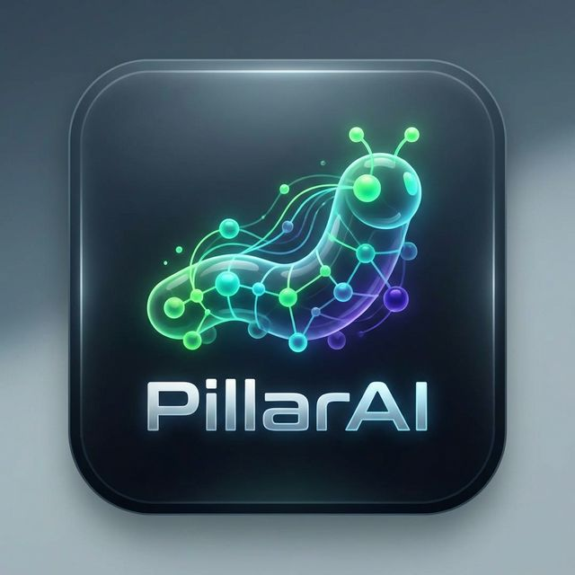

# Uygulama İsmi Analizi: PillarAI

## Neden PillarAI?

PillarAI ismi, ilk bakışta "Pillar" (Sütun, Temel Direk, Altyapı) kelimesinden türemiş gibi görünse de ve uygulamanın güvenilir, sağlam bir şirket altyapısı olduğu mesajını verse de; asıl görsel ve kavramsal ilhamını **"Caterpillar" (Tırtıl)** kelimesindeki "Pillar" kökünden almaktadır.

### Caterpillar (Tırtıl) Metaforu ve Workflow Sistemi

Otomasyon uygulamamızda her bir işlem adımı (Node) birbirine bağlanarak çalışır. Node'ların bu uç uca eklenerek bir zincir veya akış oluşturması, tıpkı bir tırtılın (caterpillar) anatomisine ve hareketlerine benzemektedir.

1. **Bağlantısallık ve Uç Uca Eklenme:**
   Tırtılın her bir segmentinin bir araya gelerek tek ve uyumlu bir bütün oluşturması gibi, sistemimizdeki her bir "node" (tetikleyici, koşul, eylem vb.) da uç uca eklenerek anlamlı ve çalışan bir "iş akışı" (workflow) yaratır.

2. **Organik Büyüme ve Esneklik:**
   PillarAI'da inşa edilen otomasyonlar da (tıpkı Lego blokları gibi) kullanıcı tarafından sürekli yeni node'lar eklenerek büyütülebilir, dallanabilir ve işletmenin değişen ihtiyaçlarına göre anında adapte edilebilir.

3. **Akış ve Hareket:**
   Tırtılın ilerleyişindeki dalgalı hareket, verinin bir node'dan diğerine nasıl kaydığını, işlendiğini ve bir sonraki adıma pürüzsüzce aktarıldığını çok başarılı bir şekilde simgeler.

4. **Sağlamlık (Sütun Etkisi):**
   İsmin iskeleti olan "Pillar" (Sütun) vurgusu, uygulamanın kurumsal bir taşıyıcı, sağlam ve devrilmez bir temel altyapı olduğunu ifade eder.

Özetle PillarAI; hem tırtıl gibi esnek ve modüler bir yapıda node bazlı olarak büyür, hem de bir sütun gibi sistemin tüm karmaşık yükünü ve verisini güvenle taşır.

## İkon ve Tasarım Felsefesi

Bu "Caterpillar / Node / Pillar" felsefesini yansıtacak tasarım konsepti aşağıdaki gibidir:

- **Bağlantılı Segmentler:** Tırtılın boğumlarını temsil eden, birbirine veri hatlarıyla bağlanmış parlayan dijital düğümler.
- **Kıvrımlı Akış:** İş akışının bir adımdan diğerine geçişini yansıtan organik duruş.
- **Renk ve Stil:** Yüksek teknolojiyi, hızı ve büyümeyi temsil eden neon yeşili, camgöbeği (cyan) ve mor/lacivert tonlarının 3 boyutlu "glassmorphism" (cam efekti) tarzında birleşimi.

